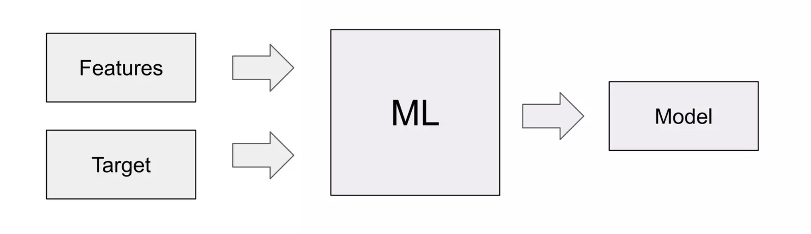

>[Back to Week Menu](README.md)
>
>Next Theme: [ML vs Rule-Based Systems](02_ml_vs_rule_based.md)

## Introduction to Machine Learning
_[Video source](https://www.youtube.com/watch?v=Crm_5n4mvmg&list=PL3MmuxUbc_hIhxl5Ji8t4O6lPAOpHaCLR&index=2)_

_[Slides](https://www.slideshare.net/AlexeyGrigorev/ml-zoomcamp-11-introduction-to-machine-learning)_

### Car Classifieds example

**In a dealership**, knowing information about a car (year, make, model, mileage, etc.), an *expert* can determine the car's price based on the knowledge of similar car prices. They extract PATTERNS from DATA for price prediction.

### ML model and Model Training

An **ML model** extracts PATTERNS from DATA and encapsulates all of them in the **Model**.

**Features** - information that we know about cars (year, model, mileage, etc.).

**Target** - what we want our model to predict (price).

### Predictions

Using this model, we can make predictions for prices of cars for which we don't know the price.

**Predictions** - information that the **Model** outputs (predicts) using **Features** (all the DATA about objects without **Target**) 

_[Back to the top](#introduction-to-machine-learning)_