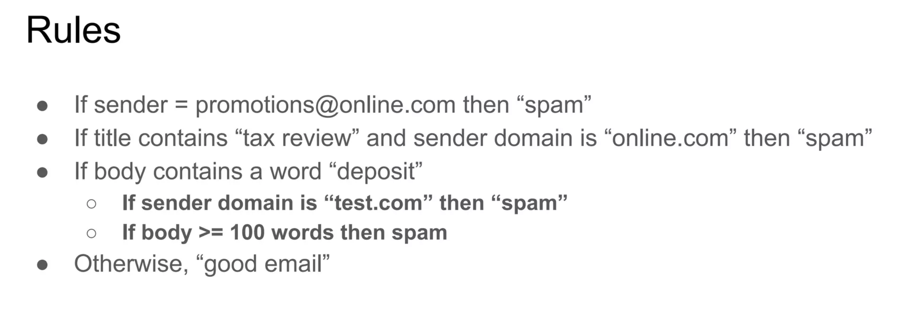
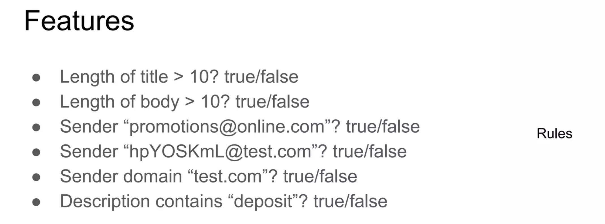
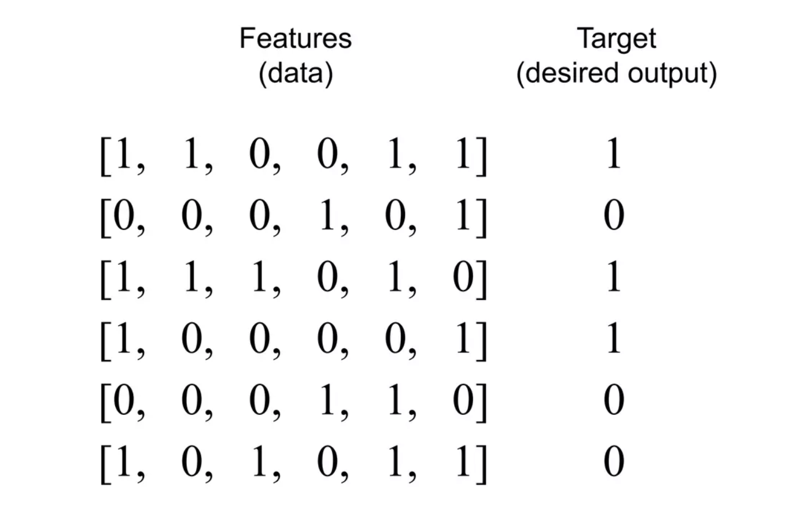
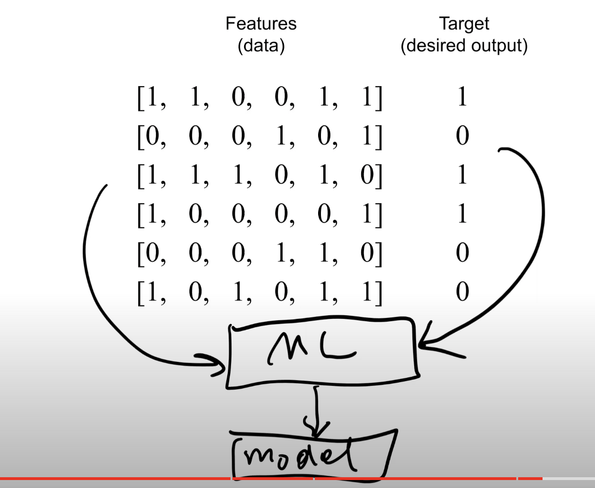
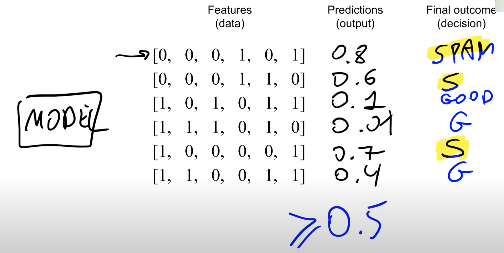
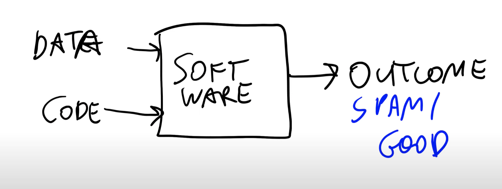
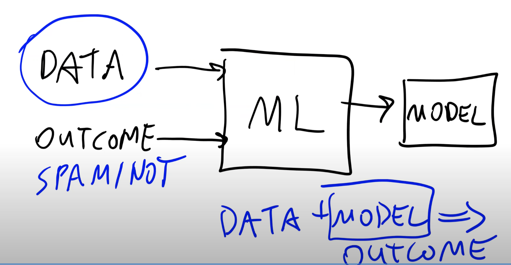

>[Back to Week Menu](README.md)
>
>Previous Theme: [Introduction to Machine Learning](01_intro.md)
>
>Next Theme: [Supervised Machine Learning](03_supervised_ml.md)

## ML vs Rule-Based Systems
_[Video source](https://www.youtube.com/watch?v=CeukwyUdaz8&list=PL3MmuxUbc_hIhxl5Ji8t4O6lPAOpHaCLR&index=3)_

_[Slides](https://www.slideshare.net/AlexeyGrigorev/ml-zoomcamp-12-ml-vs-rulebased-systems)_

### Rule based Systems

In **Rule-based Systems**, rules (such as keywords, email length, sender reputation, and others) are utilized to make decisions or filter information. For instance, in a spam detection system, rules determine whether an email is spam or not.

A significant **disadvantage** of this approach is that the system needs to be constantly upgraded and maintained. This is because rules can change rapidly, making it challenging to keep the system current.

### Use Machine Learning

To use machine learning, we need to:
* Collect **data**
 For a spam detection system, gather all emails from the Spam folder (which users marked as spam) as *spam*, and the rest as *not spam*.
* Define & calculate **Features**

Most of the **Features** are based on the rules we used in the **Rule-based System**.
 Using these **Features**, we can encode all our emails.

* Train & use the **Model**
 We input the Features (data) and Target (desired output) into the ML algorithm, train a model and receive a Model as the output.

We use this **Model** for our predictions

### Summary

#### Rule based Systems

#### Machine Learning

_[Back to the top](#ml-vs-rule-based-systems)_