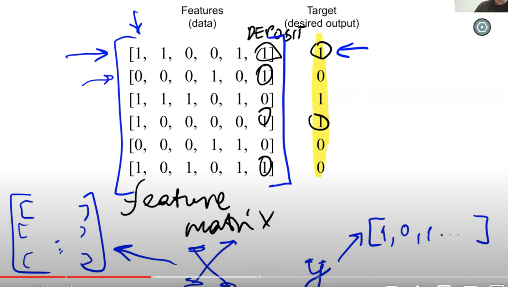
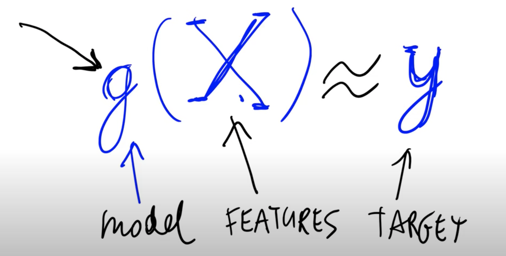
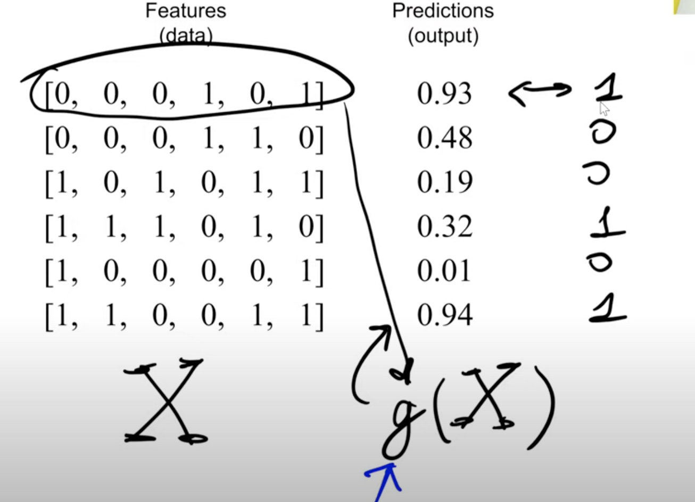
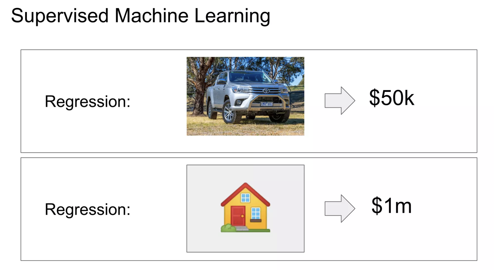
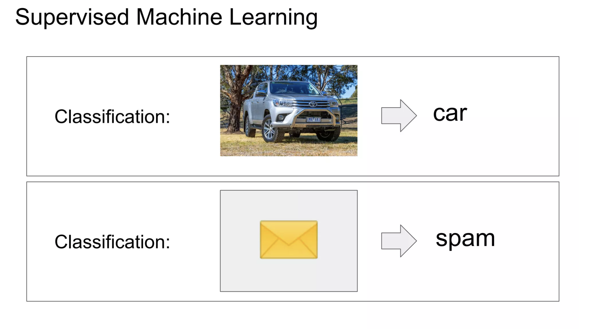
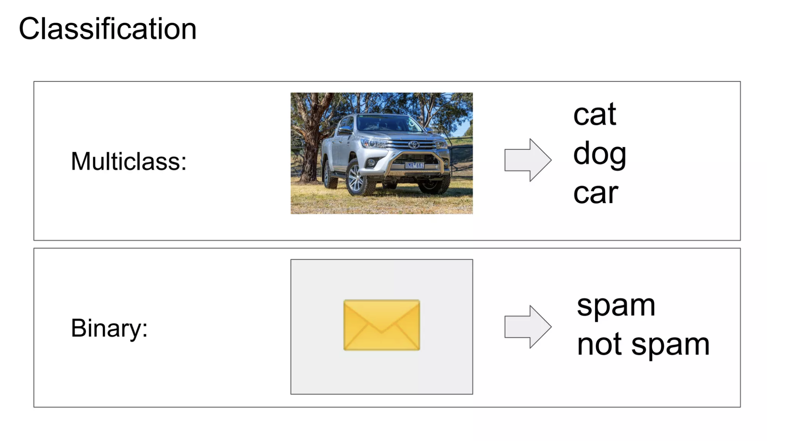

>[Back to Week Menu](README.md)
>
>Previous Theme: [ML vs Rule-Based Systems](02_ml_vs_rule_based.md)
>
>Next Theme: [CRISP-DM](04_crisp_dm.md)

## Supervised Machine Learning
_[Video source](https://www.youtube.com/watch?v=j9kcEuGcC2Y&list=PL3MmuxUbc_hIhxl5Ji8t4O6lPAOpHaCLR&index=4)_

_[Slides](https://www.slideshare.net/AlexeyGrigorev/ml-zoomcamp-13-supervised-machine-learning)_

### Explanation

Train a **Model (function g)** using the **Feature Matrix (X)** to approximate the **Target (y)** as closely as possible

For example, consider spam emails:

### Types of Supervised Machine Learning problems
* **Regression**
  The *Target* is a **value**. The model (g) returns a value (y). This type is used to predict numerical values, like price.

* **Classification**
  Tee *Target* ia a **category**. For instance, classifying an image as a picture of a car.

    * *Binary classification*. 2 categories.
    * *Multiclass classification*. More than 2 categories.
    

* **Ranking**
  Used in scenarios where ranking is essential, such as recommender systems.

_[Back to the top](#supervised-machine-learning)_