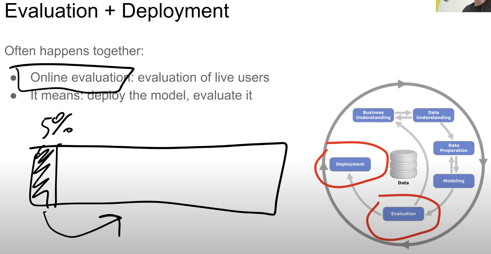

>[Back to Week Menu](README.md)
>
>Previous Theme: [Supervised Machine Learning](03_supervised_ml.md)
>
>Next Theme: [Model Selection Process](05_model_selection_process.md)

## CRISP-DM
_[Video source](https://www.youtube.com/watch?v=dCa3JvmJbr0&list=PL3MmuxUbc_hIhxl5Ji8t4O6lPAOpHaCLR&index=5)_

_[Slides](https://www.slideshare.net/AlexeyGrigorev/ml-zoomcamp-14-crispdm)_

### Explanation
CRISP-DM (Cross-Industry Standard Process for Data Mining) is a methodology that outlines how ML projects should be organized.

There are 6 steps in this methodology:
1. **Business understanding**
 Identify the problem we want to solve. Ask a question: Do we actually need ML here?

Define the goal. The **goal** should be *measurable*.

2. **Data understanding**
 Analyze available data sources and determine if more data is needed.

Understanding the data can provide insights into the business problem, influencing the goal. We can then revisit the previous step and adjust it.

3. **Data preparation**
 Transform data to be compatible with ML algorithms.

Clean the data, remove noise, and build a data pipeline.

The result of this step will be **X (Featues)** and **y (Target)**.

4. **Modeling**
    * Training a model:
        * Try different models
        * Select the best one
    * Which model to choose?
        * Logistic regression
        * Decision tree
        * Neural network
        * Or many others
    * Sometimes, we may go back to data preparation:
        * Add new features
        * Fix data issues

5. **Evaluation**
 Measure how well the model solves the business problem.

Compare the result with the goal set during the *Business understanding* phase. If necessary, adjust the goal or terminate the project.

6. **Deployment**
 Often *Evaluation* and *Deployment* comes together.

 Typically, evaluate the model on a subset of users (e.g., 5%). If the model performs well, roll it out to the remaining users.

**Iterate**
 After deployment we iterate (maybe want to improve goal or find new goals for *Business understanding*)

Iteration process

### Summary

_[Back to the top](#crisp-dm)_