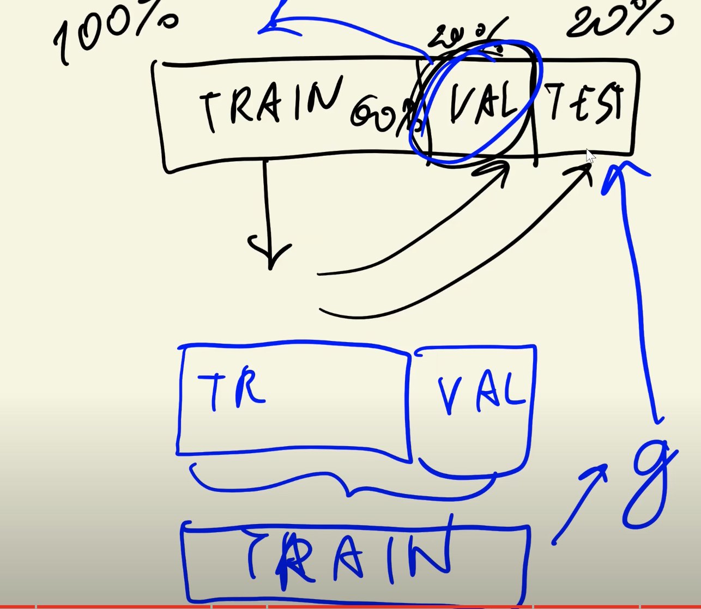

>[Back to Week Menu](README.md)
>
>Previous Theme: [CRISP-DM](04_crisp_dm.md)
>
>Next Theme: [Setting up the Environment](06_environment.md)

## Model Selection Process
_[Video source](https://www.youtube.com/watch?v=OH_R0Sl9neM&list=PL3MmuxUbc_hIhxl5Ji8t4O6lPAOpHaCLR&index=6)_

_[Slides](https://www.slideshare.net/AlexeyGrigorev/ml-zoomcamp-15-model-selection-process)_

### Introduction
The process of selecting the best model.

### Holdout + Train
Take a portion of DATA (e.g., 20%) and hide it. Use only remaining 80% for **Training**. The 20% is used for **Validation**.

### Making Predictions
Extract the  **Feature Matrix (X)** and **Target (y)** from *Training DATA* and train our **Model(g)**.
 Then, from the *Validation DATA* extract another **Feature Matrix ($X_v$)** and **Target ($y_v$)** which our Model hasn't seen.
 After that, apply our **Model(g)** to the *Validation* dataset and get some predictions $\hat{y}$ and compare them with **Target($y_v$)**.
 
 $g(X_v)=\hat{y}_v$

As a result of camparing, we obtain accuracy for our model:

### Scoring
Repeat the process for different types of models and choose the model with the best accuracy:
* Logistic Regression
* Decision Tree
* Random Forest
* Neural Network

### Multiple Comparisons Problem
A model might be lucky and achieve good predictions by chance since these methods are probabilistic.

### Train + Validation + Test
To address the above problem, instead of holding 1 dataset, we hold 2 datasets. We split the dataset into:
* Training
* Validation
* Test

Then, find the best Model using the **Trining** and **Validation** datasets.Apply this Model to the **Test** dataset to ensure that the Model chosen is actually the best one.

### Further scoring

### Model Selection (6 steps)
1. **Split** the Dataset into 3 parts.
2. **Train** a model.
3. Apply the Model to the **Validaion** dataset.
4. Repeat steps 2 and 3 multiple times for different Models and **Select** the best one.
5. Apply the best Model to the **Test** dataset.
6. **Check** if everything is satisfactory.

In this approach, we use the **Validation** dataset only once. Thus, we combain the **Training** and **Validation** datasets and retrain our best model with them (between steps 4 and 5). This should help improve the model.

_[Back to the top](#model-selection-process)_