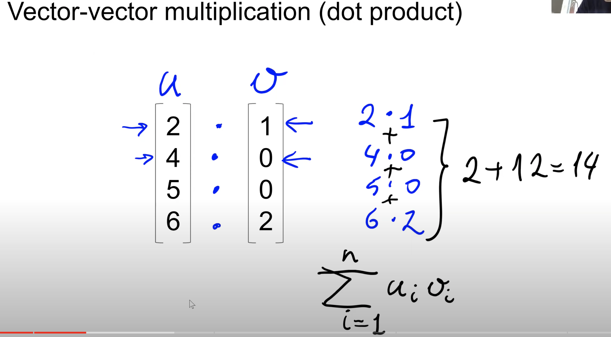

>[Back to Week Menu](README.md)
>
>Previous Theme: [Introduction to NumPy](07_intro_numpy.md)
>
>Next Theme: [Introduction to Pandas](09_pandas.md)

## Linear Algebra Refresher
_[Video source](https://www.youtube.com/watch?v=zZyKUeOR4Gg&list=PL3MmuxUbc_hIhxl5Ji8t4O6lPAOpHaCLR&index=8)_

_[Slides](https://www.slideshare.net/AlexeyGrigorev/ml-zoomcamp-18-linear-algebra-refresher)_

### Vector operations

* Muliply vector by number:

    ```
    u = np.array([2, 4, 5, 6])
    u
    >> array([2, 4, 5, 6])

    2 * u
    >> array([ 4,  8, 10, 12])
    ```
* Add 2 vectors:

    ```
    u = np.array([2, 4, 5, 6])
    u
    >> array([2, 4, 5, 6])
    v = np.array([1, 0, 0, 2])
    v
    >> array([1, 0, 0, 2])

    u + v
    >> array([3, 4, 5, 8])
    ```

### Vector-vector multiplication (dot product)

$u \cdot v = \displaystyle\sum_{i=1}^n u_iv_i$

Transpose operation - turn a column vector into a row vector.

$v^T \cdot u = \displaystyle\sum_{i=1}^n u_iv_i$

```
def vector_vector_multiplication(u, v):
    assert u.shape[0] == v.shape[0]
    
    n = u.shape[0]
    result = 0.0
    
    for i in range(n):
        result += u[i] * v[i]
        
    return result
```

```
vector_vector_multiplication(u, v)
>> 14.0
```

In NumPy there is also have a function for this:
```
u.dot(v)
>> 14
```

### Matrix-vector multiplication


$U \cdot v = u^Tv$

$\begin{bmatrix}
u_{00} & u_{01} & \dots & u_{0n-1} \\
u_{10} & u_{11} & \dots & u_{1n-1} \\
\vdots & \vdots & \ddots & \vdots \\
u_{k-10} & u_{k-11} & \dots & u_{k-1n-1} \\
\end{bmatrix}
\cdot 
\begin{bmatrix}
v_0 \\
v_1 \\
\vdots \\
v_n-1 \\
\end{bmatrix} = 
\begin{bmatrix}
u_0^Tv \\
u_1^Tv \\
\vdots \\
u_{k-1}^Tv \\
\end{bmatrix}
$

```
def matrix_vector_multiplication(U, v):
    assert U.shape[1] == v.shape[0]
    
    num_rows = U.shape[0]
    result = np.zeros(num_rows)
    
    for i in range(num_rows):
        result[i] = vector_vector_multiplication(U[i], v)
        
    return result
```

```
matrix_vector_multiplication(U, v)
>> array([14.,  5.,  5.])
```

In NumPy there is also have a function for this:
```
U.dot(v)
>> array([14,  5,  5])
```


### Matrix-matrix multiplication


$U \cdot V = UV$

$\begin{bmatrix}
u_{00} & u_{01} & \dots & u_{0n-1} \\
u_{10} & u_{11} & \dots & u_{1n-1} \\
\vdots & \vdots & \ddots & \vdots \\
u_{m-10} & u_{m-11} & \dots & u_{m-1n-1} \\
\end{bmatrix}
\cdot 
\begin{bmatrix}
v_{00} & v_{01} & \dots & v_{0p-1} \\
v_{10} & v_{11} & \dots & v_{1p-1} \\
\vdots & \vdots & \ddots & \vdots \\
v_{n-10} & v_{n-11} & \dots & v_{n-1p-1} \\
\end{bmatrix} = 
\begin{bmatrix}
w_{00} & w_{01} & \dots & w_{0p-1} \\
w_{10} & w_{11} & \dots & w_{1p-1} \\
\vdots & \vdots & \ddots & \vdots \\
w_{m-10} & w_{m-11} & \dots & w_{m-1p-1} \\
\end{bmatrix}
$

where $w_{ij} = \displaystyle\sum_{k=0}^{n-1} u_{ik}v_{kj}$, 
for $i = 0, \dots, m-1$ and $j = 0, \dots, p-1$

```
def matrix_matrix_multiplication(U, V):
    assert U.shape[1] == V.shape[0]
    
    num_rows = U.shape[0]
    num_cols = V.shape[1]
    
    result = np.zeros((num_rows, num_cols))
    
    for i in range(num_cols):
        vi = V[:, i]
        Uvi = matrix_vector_multiplication(U, vi)
        result[:, i] = Uvi
    
    return result   
```

```
matrix_matrix_multiplication(U, V)
>> array([[14. , 20. , 13. ],
       [ 5. ,  6. ,  5. ],
       [ 5. ,  8.5,  9. ]])
```

In NumPy there is also have a function for this:
```
U.dot(V)
>> array([[14. , 20. , 13. ],
       [ 5. ,  6. ,  5. ],
       [ 5. ,  8.5,  9. ]])
```

### Identity matrix

Identity matrix - square matrix, where diagonal has '1', others elements -'0'.


For Identity matrix we have:

$U \cdot I = U$

$I \cdot U = U$

In NumPy to create an Identity matrix:
```
np.eye(10)
>> array([[1., 0., 0., 0., 0., 0., 0., 0., 0., 0.],
       [0., 1., 0., 0., 0., 0., 0., 0., 0., 0.],
       [0., 0., 1., 0., 0., 0., 0., 0., 0., 0.],
       [0., 0., 0., 1., 0., 0., 0., 0., 0., 0.],
       [0., 0., 0., 0., 1., 0., 0., 0., 0., 0.],
       [0., 0., 0., 0., 0., 1., 0., 0., 0., 0.],
       [0., 0., 0., 0., 0., 0., 1., 0., 0., 0.],
       [0., 0., 0., 0., 0., 0., 0., 1., 0., 0.],
       [0., 0., 0., 0., 0., 0., 0., 0., 1., 0.],
       [0., 0., 0., 0., 0., 0., 0., 0., 0., 1.]])
```

### Matrix inverse

**Inverse Matrix ($A^{-1}$)** - matrix that, which multiply by $A$ get matrix $I$.


```
Vs = np.array([
    [1, 1, 2],
    [0, 0.5, 1], 
    [0, 2, 1],
])
Vs_inv = np.linalg.inv(Vs)

Vs_inv.dot(Vs)
>> array([[1., 0., 0.],
       [0., 1., 0.],
       [0., 0., 1.]])
```

_[Back to the top](#linear-algebra-refresher)_