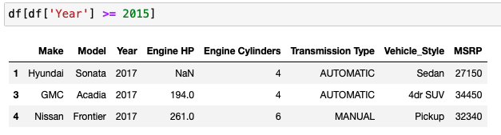

>[Back to Week Menu](README.md)
>
>Previous Theme: [Linear Algebra Refresher](08_linear_algebra.md)
>
>Next Theme: [Summary](10_summary.md)

## Introduction to Pandas
_[Video source](https://www.youtube.com/watch?v=0j3XK5PsnxA&list=PL3MmuxUbc_hIhxl5Ji8t4O6lPAOpHaCLR&index=9)_


### Import pandas

```
import pandas as pd
```

### DataFrames

Create dataframe (table) with specific columns:
```
df = pd.DataFrame(data, columns=columns)
```

**data** can be a list of lists or list of dictionaries.

Return n-first rows:
```
df.head(n=2)
```


### Series

Dataframe consists of Series (columns). Every column is a Series.
To get specific Series we can use '.'-notation or put name of Series in brackets:
```
df.Make
df['Make']
```


Add column into Dataframe:
```
df['id'] = [1, 2, 3, 4, 5]
```


Delete column from Dataframe:
```
del df['id']
```

### Index

```
df.index
>> RangeIndex(start=0, stop=5, step=1)
```

### Accessing elements

Get rows by index:
```
df.loc[1]
df.loc[[1, 2]]
```


Replace index:
```
df.index = ['a', 'b', 'c', 'd', 'e']
```

Get elements by **positional index**:
```
df.iloc[[1, 2]]
```

Reset index and doesn't change Dataframe:
```
df.reset_index()
```

Reset index and drop previous index and doesn't change Dataframe:
```
df.reset_index(drop=True)
```

Rest index and save to Dataframe:
```
df = df.reset_index(drop=True)
```

### Element-wise operations

Opearations with all Series (columns):


Logical opeartors:


### Filtering



Combain filtering:


### String operations

To lower case:
```
'STRr'.lower()
>> 'strr'
```

Replace:
```
'machine learning'.replace(' ', '_')
>> 'machine_learning'
```


### Summarizing operations

Operations min(), max(), mean()


Provide summary statistic about column:


Provide summary statistic for all numerical columns in Dataframe:


Count unique values:


### Missing values

Find missing values (NaN), return True if the value is Nan:


Count the number of missing values (NaN) in each column:


### Grouping


### Getting the NumPy arrays

To get the underlying NumPy array (use .values):


Convert DataFrame to list of dictionaries (per record):

```
df.to_dict(orient='records')
```


_[Back to the top](#introduction-to-pandas)_