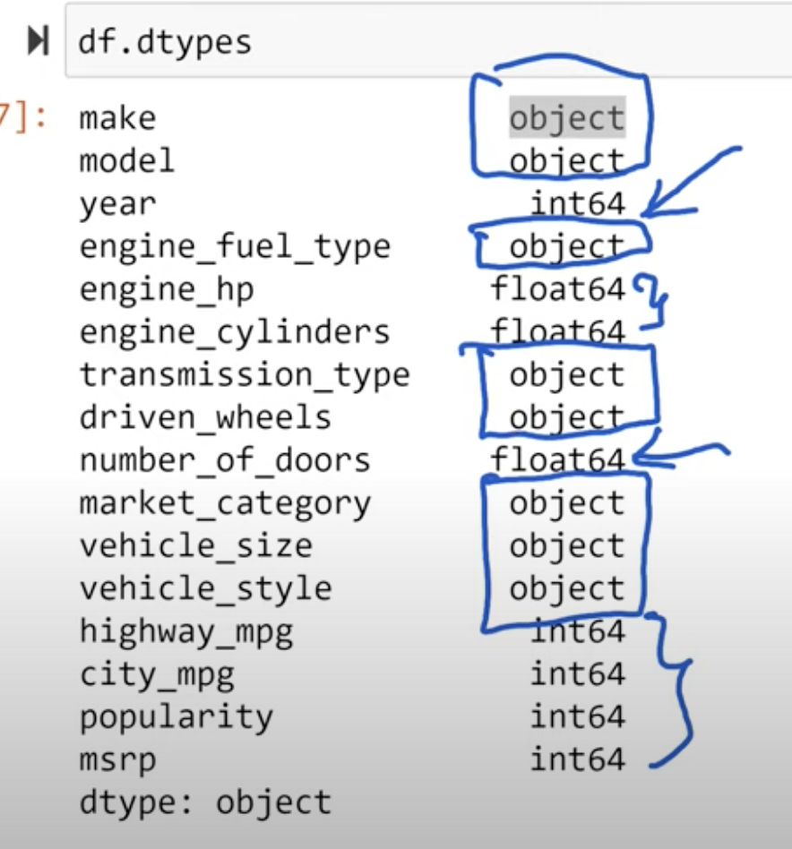

>[Back to Week Menu](README.md)
>
>Previous Theme: [Car price prediction project](01_car_price_intro.md)
>
>Next Theme: [Exploratory data analysis](03_eda.md)

## Data preparation
_[Video source](https://www.youtube.com/watch?v=vM3SqPNlStE&list=PL3MmuxUbc_hIhxl5Ji8t4O6lPAOpHaCLR&index=13)_

_[Slides](https://www.slideshare.net/AlexeyGrigorev/ml-zoomcamp-2-slides)_


### Download the dataset

```
data = 'https://raw.githubusercontent.com/alexeygrigorev/mlbookcamp-code/master/chapter-02-car-price/data.csv'

!wget $data
```

### Load the dataset

```
df = pd.read_csv('data.csv')

df.head()
```

### Normalize the dataset

Convert names of columns to lower case and use '_' instead of 'space':
```
df.columns = df.columns.str.lower().str.replace(' ', '_')
```
We need to define columns that contain string values (object type):
```
df.dtypes
```



```
strings = list(df.dtypes[df.dtypes == 'object'].index)
```

Convert all string values in DataFrame to lower case and use '_' instead of 'space':
```
for col in strings:
    df[col] = df[col].str.lower().str.replace(' ', '_')
```

_[Back to the top](#data-preparation)_