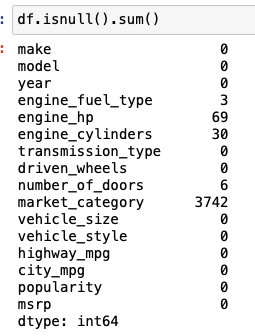

>[Back to Week Menu](README.md)
>
>Previous Theme: [Data preparation](02_data_preparation.md)
>
>Next Theme: [Setting up the validation framework](04_validation_framework.md)

## Exploratory data analysis
_[Video source](https://www.youtube.com/watch?v=vM3SqPNlStE&list=PL3MmuxUbc_hIhxl5Ji8t4O6lPAOpHaCLR&index=14)_

_[Slides](https://www.slideshare.net/AlexeyGrigorev/ml-zoomcamp-2-slides)_


### Returning unique values in series

To see how many unique values each column has:
```
for col in df.columns:
    print(col)
    print(df[col].unique()[:5])
    print(df[col].nunique())
    print()
```


### Visualize the dataset

For visualization use librarires:
* matplotlib
* seaborn

```
import seaborn as sns
from matplotlib import pyplot as plt

%matplotlib inline
```

```
sns.histplot(df.msrp, bins=50)
```


### Long tail distribution


### Apply logarithmic distribution

This kind of distribution (Long tail distribution) is not very good for ML, this tail will confuse our Model.

Then we need to get rid of this long tail. To do this, we apply the **logarithmic distribution**.

We apply the logarithm to the price and get more compact values. Because the $\log{0}$ doesn't exist we add '1' to all the elements. There is a function in NumPy that do this for us (1p means 'plus 1'):
```
np.log1p([0, 1, 10, 1000, 100000])
```

```
price_logs = np.log1p(df.msrp)
price_logs
```

And draw with new prices:


### Plot the normal distribution

Now we get **Normal distribution**. This situation is ideal for Models


### Look at missing values

Check for NULL values:
```
df.isnull()
```

Get how many missing values in each column:
```
df.isnull().sum()
```


We need to keep this in mind when we train our Model.


_[Back to the top](#exploratory-data-analysis)_