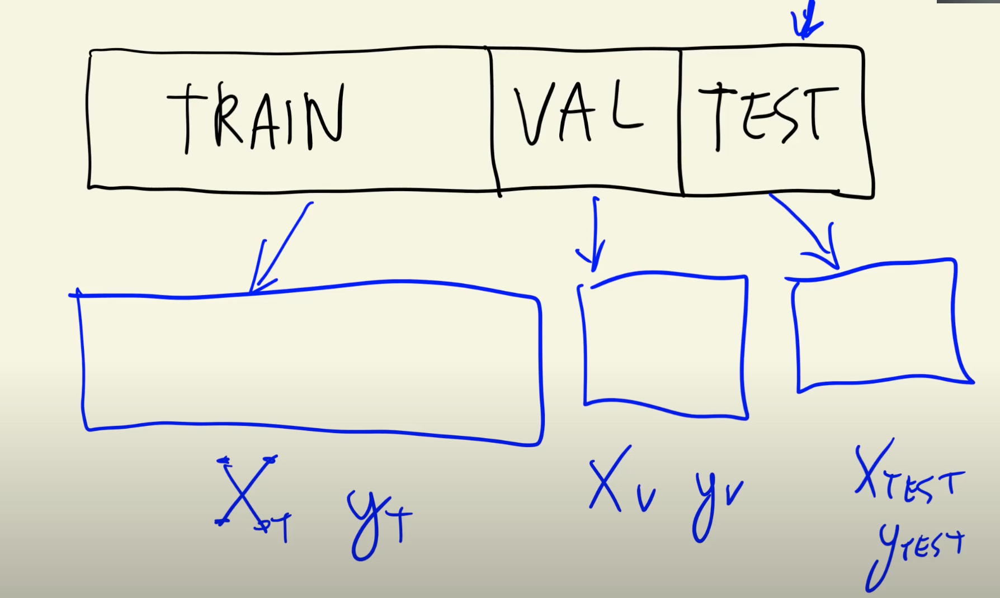
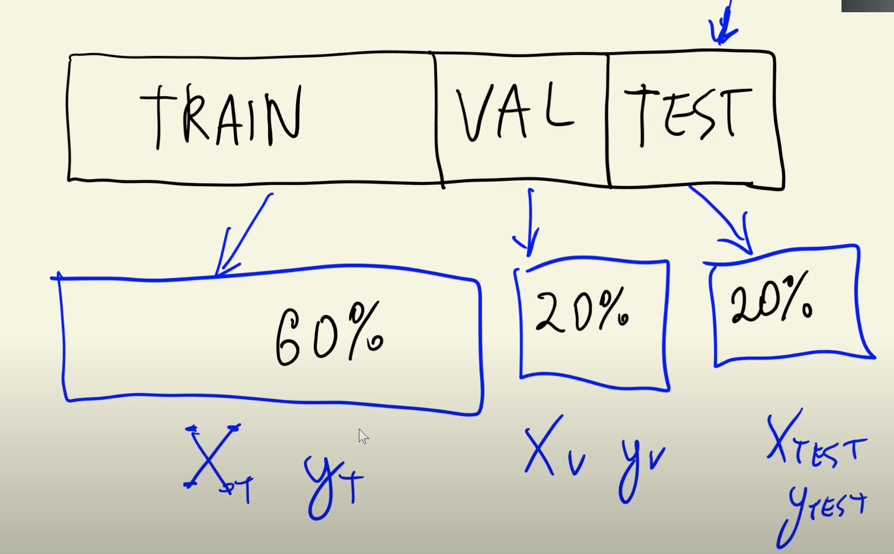

>[Back to Week Menu](README.md)
>
>Previous Theme: [Exploratory data analysis](03_eda.md)
>
>Next Theme: [Linear regression](05_linear_regression_simple.md)

## Setting up the validation framework
_[Video source](https://www.youtube.com/watch?v=vM3SqPNlStE&list=PL3MmuxUbc_hIhxl5Ji8t4O6lPAOpHaCLR&index=15)_


### Intro



### Split dataframe into train, test, and validation

Split dataset into 60%, 20% and 20% parts:



```
n = len(df)
n_val = int(n * 0.2)
n_test = int(n * 0.2)
n_train = n - n_val - n_test
```

```
n_val, n_test, n_train
>> (2382, 2382, 7150)
```

### Create the new dataframes

```
df_train = df.iloc[:n_train]
df_val = df.iloc[n_train:n_train+n_val]
df_test = df.iloc[n_train+n_val:]
```

### Shuffle the records in dataframe

Because our data is sorted by Make, we have 'bmw' only in Validation Dataset. Then we need to shuffle data.

Shuffle the indices:
```
idx = np.arange(n)

np.random.seed(2)   # for reproducibility
np.random.shuffle(idx)
```

Create new Dataframes with shuffled indices:
```
df_train = df.iloc[idx[:n_train]]
df_val = df.iloc[idx[n_train:n_train+n_val]]
df_test = df.iloc[idx[n_train+n_val:]]
```

Check len of dataframes:
```
len(df_val), len(df_test), len(df_train)
>> (2382, 2382, 7150)
```

### Reset the indices of each dataframe

Reset the original indices:
```
df_train = df_train.reset_index(drop=True)
df_val = df_val.reset_index(drop=True)
df_test = df_test.reset_index(drop=True)
```

### Get the target variables (y)

Apply the log transformation to price(msrp) column:

```
y_train = np.log1p(df_train.msrp.values)
y_val = np.log1p(df_val.msrp.values)
y_test = np.log1p(df_test.msrp.values)
```

### Remove the msrp from the dataframes

To avoid using it accidentally for Model training:
```
del df_train['msrp']
del df_val['msrp']
del df_test['msrp']
```

_[Back to the top](#setting-up-the-validation-framework)_