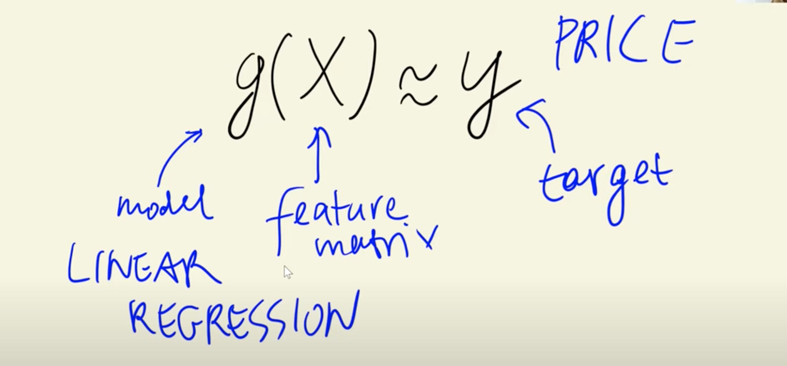
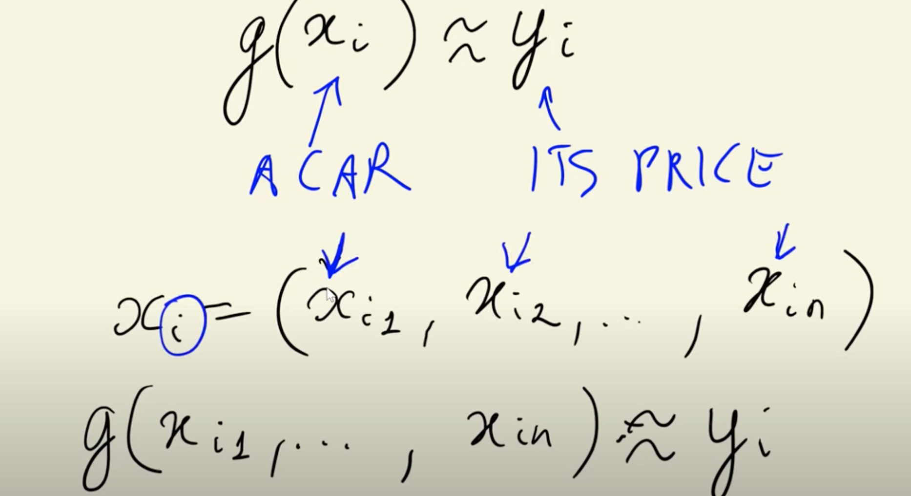
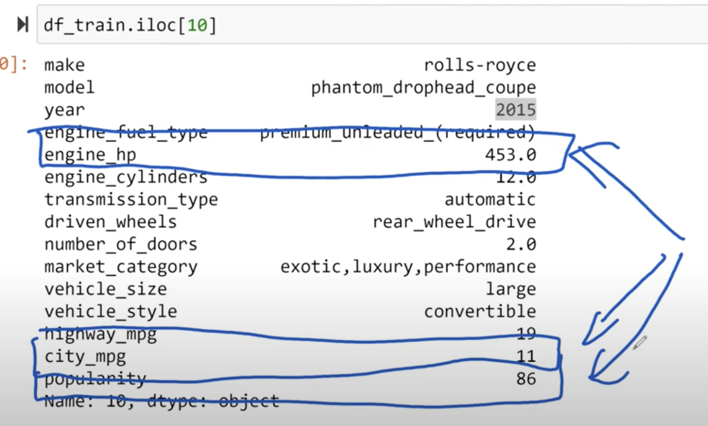
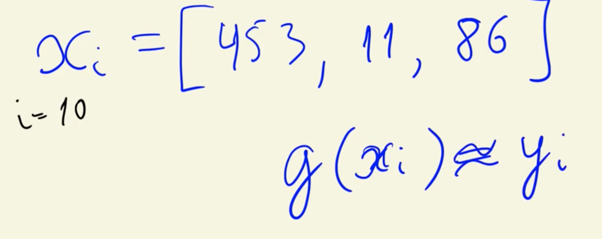
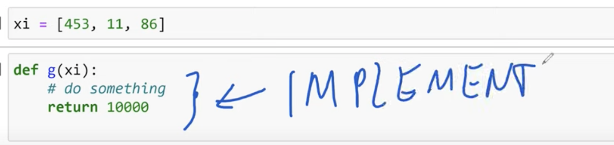
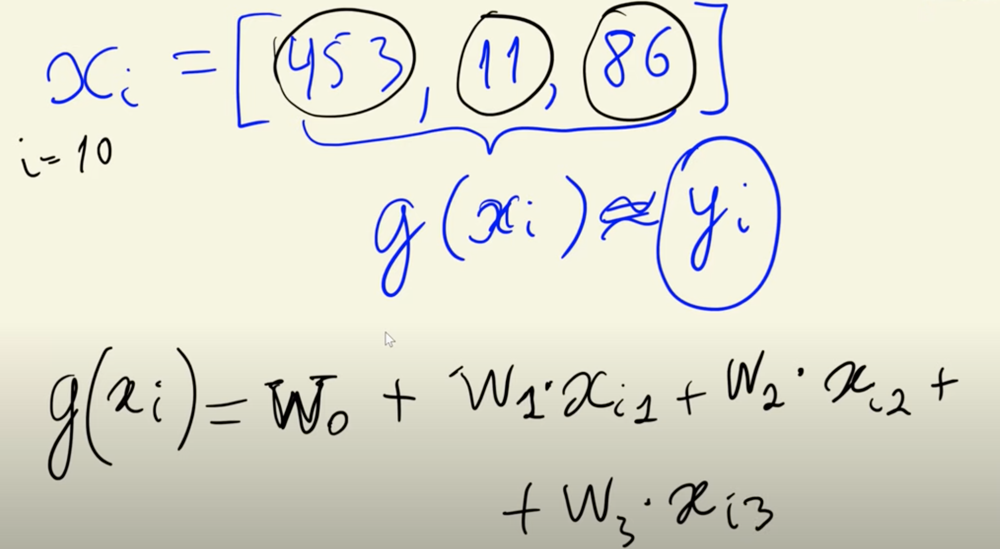
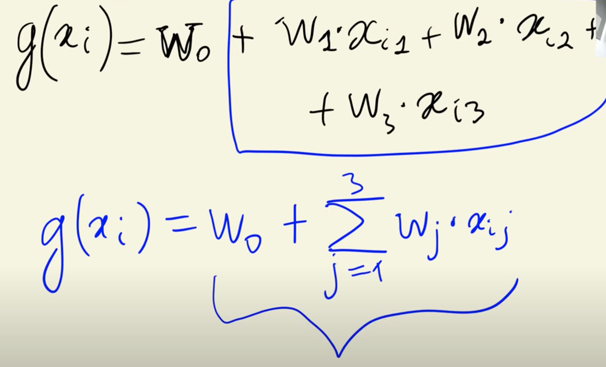
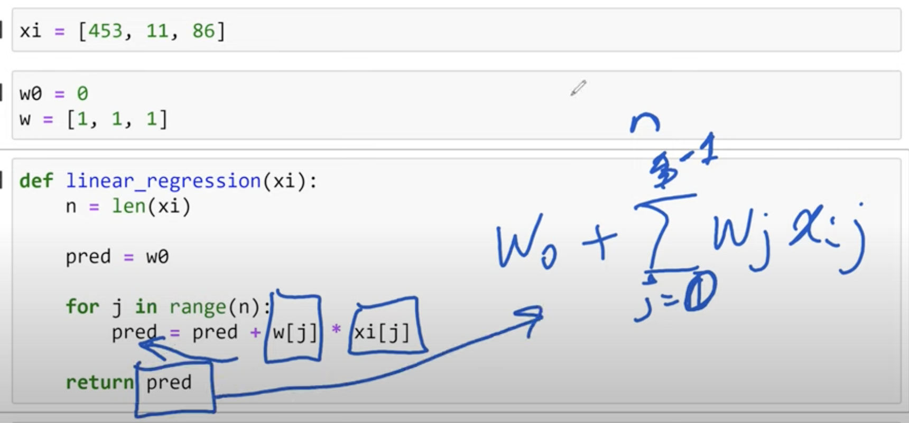
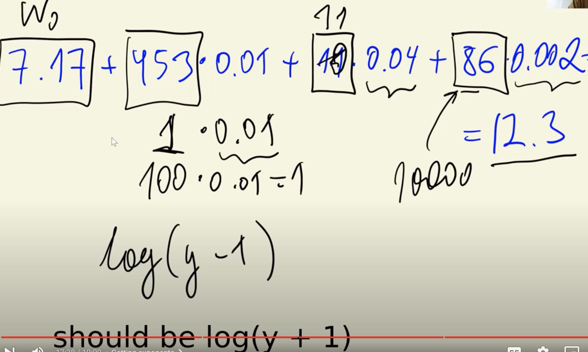

>[Back to Week Menu](README.md)
>
>Previous Theme: [Setting up the validation framework](04_validation_framework.md)
>
>Next Theme: [Linear regression: vector form](06_linear_regression_vector.md)

## Linear regression
_[Video source](https://www.youtube.com/watch?v=vM3SqPNlStE&list=PL3MmuxUbc_hIhxl5Ji8t4O6lPAOpHaCLR&index=16)_

### What is Linear Regression

**Linear Regression** is a model used for solving regression problems, aimed at predicting numerical values.



### Simplified form

Examine one car at a time, instead of the entire dataset:


### Example Using Training Data

For example, take row number 10 from the **Training** dataset and focus on the 'engine_hp,' 'city_mpg,' and 'popularity' columns:


The objective is to find the function $g(x_i)$.





### Implementation

The general form of the linear regression equation is:



$g(x_i) = w_0 + x_{i1} \cdot w_1 + x_{i2} \cdot w_2 + ... + x_{in} \cdot w_n$

$g(x_i) = w_0 + \displaystyle\sum_{j=1}^{n} w_j \cdot x_{ij}$

where $w_0$ is the bias term.



### Implementation in code



Put other values for $w_0$ and $w$:
```python
w0 = 7.17
w = [0.01, 0.04, 0.002]
```

```python
def linear_regression(xi):
    n = len(xi)
    
    pred = w0
    
    for j in range(n):
        pred += w[j] * xi[j]
    
    return pred
```

```python
linear_regression(xi)
>> 12.312
```

### Breakdown explanation



### Converting Predictions

To convert the logarithmic prediction back to the original price, you can use:
```python
np.exp(12.312) - 1
>> 222347.2221101062

np.expm1(12.312)    # the same
```

_[Back to the top](#linear-regression)_