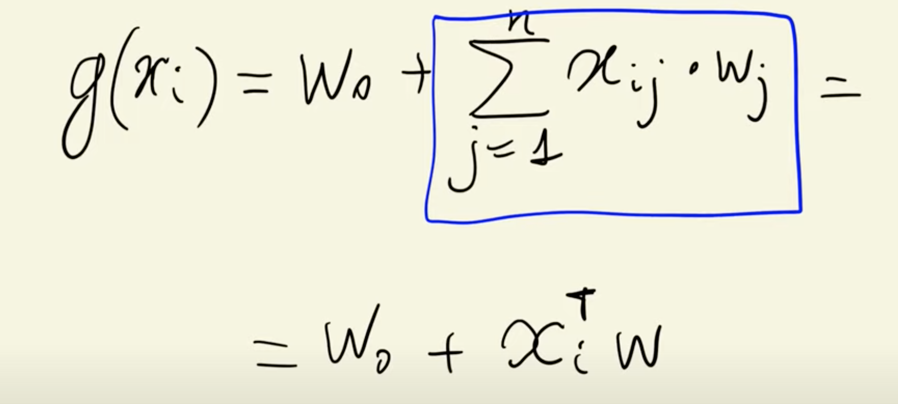
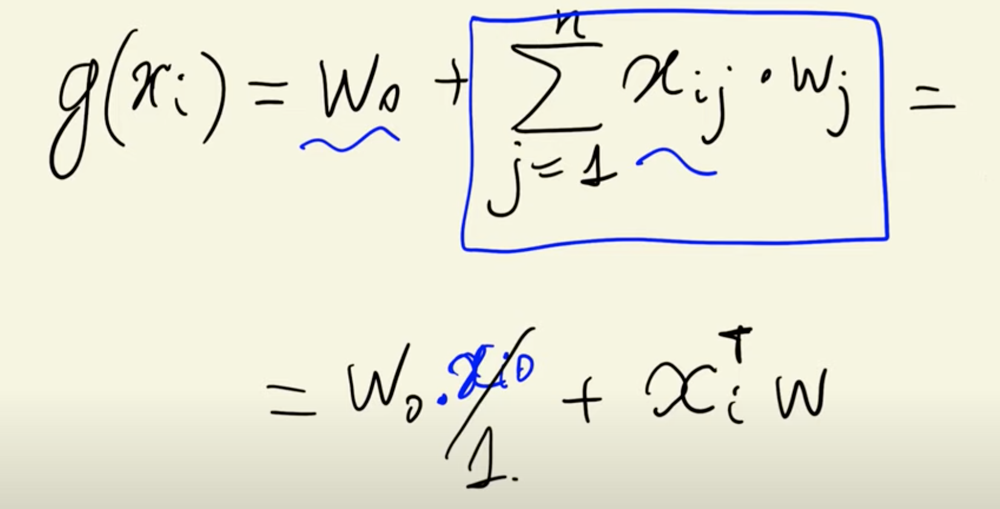
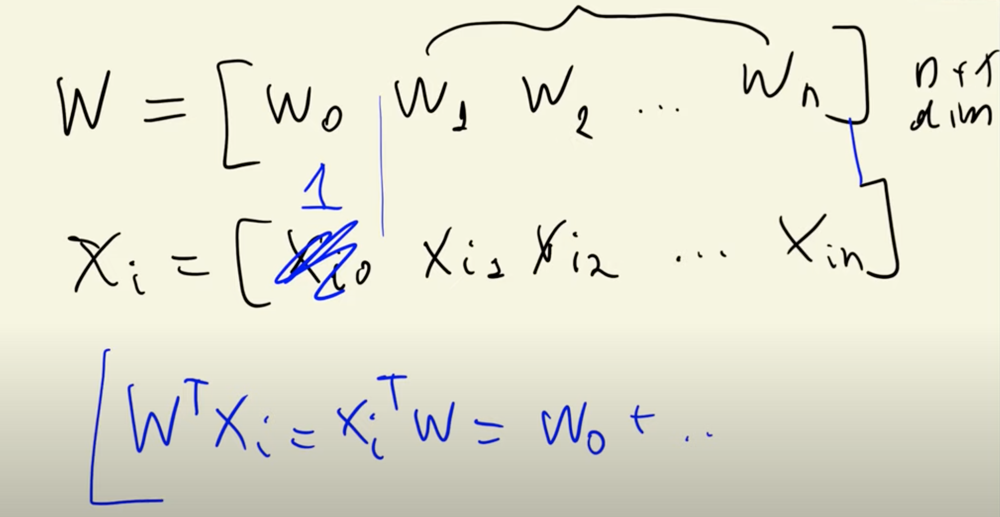
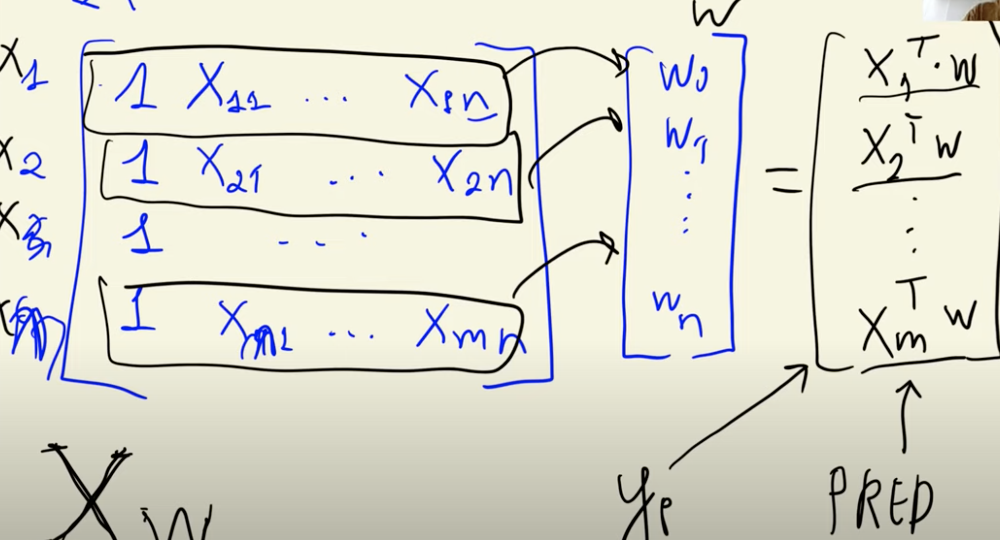

>[Back to Week Menu](README.md)
>
>Previous Theme: [Linear regression](05_linear_regression_simple.md)
>
>Next Theme: [Training linear regression: Normal equation](07_linear_regression_training.md)

## Linear regression: vector form
_[Video source](https://www.youtube.com/watch?v=vM3SqPNlStE&list=PL3MmuxUbc_hIhxl5Ji8t4O6lPAOpHaCLR&index=17)_

### Recap

Now we generalize formula: go from $x_i$ to $X$.

### Recap of linear regression - single vector

$g(x_i) = w_0 + \displaystyle\sum_{j=1}^{n} w_j \cdot x_{ij}$

### Linear regression - vector form - dot product

Because $\displaystyle\sum_{j=1}^{n} w_j \cdot x_{ij}$ - dot product (vector-vector multiplication), we can rewrite:

$g(x_i) = w_0 + \displaystyle\sum_{j=1}^{n} w_j \cdot x_{ij} = w_0 + x_i^Tw$



### Linear regression - dot product implementation

Simplify using dot product:

```python
def dot(xi, w):
    n = len(xi)
    
    res = 0.0
    
    for j in range(n):
        res += xi[j] * w[j]
        
    return res

def linear_regression(xi):
    return w0 + dot(xi, w)    
```

### Linear regression - shorter notation




$w = [w_0 w_1 w_2 \dots w_n]$

$x_i = [x_{i0} x_{i1} x_{i2} \dots x_{in}]$, where $x_{i0} = 1$

$w^Tx_i = x_i^Tw = w_0 + \dots$

Then we can use dot product notation for the entire Linear Regression.



```python
w_new = [w0] + w

def linear_regression(xi):
    xi = [1] + xi
    return dot(xi, w_new)

linear_regression(xi)
>> 12.312
```

### All Examples - matrix notation




$\begin{bmatrix}
1 & x_{11} & \dots & x_{1n} \\
1 & x_{21} & \dots & x_{2n} \\
\vdots & \vdots & \ddots & \vdots \\
1 & x_{m1} & \dots & x_{mn} \\
\end{bmatrix}
\cdot 
\begin{bmatrix}
w_0 \\
w_1 \\
\vdots \\
w_n \\
\end{bmatrix} = 
\begin{bmatrix}
x_1^Tw \\
x_2^Tw \\
\vdots \\
x_m^Tw \\
\end{bmatrix}
$

### Perform matrix vector multiplication

```python
w0 = 7.17
w = [0.01, 0.04, 0.002]
w_new = [w0] + w

x1 = [1, 148, 24, 1385]
x2 = [1, 132, 25, 2031]
x10 = [1, 453, 11, 86]

X = [x1, x2, x10]
X = np.array(X)
X
>> array([[   1,  148,   24, 1385],
       [   1,  132,   25, 2031],
       [   1,  453,   11,   86]])
```

```python
X.dot(w_new)
>> array([12.38 , 13.552, 12.312])
```

### Implementation of linear_regression()

```python
def linear_regression(X):
    return X.dot(w_new)

linear_regression(X)
>> array([12.38 , 13.552, 12.312])
```

_[Back to the top](#linear-regression-vector-form)_