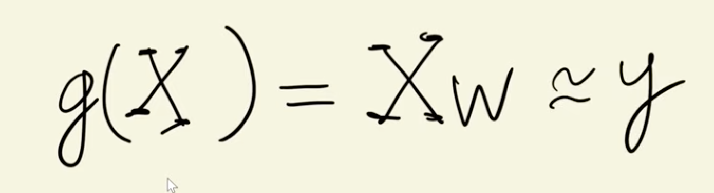
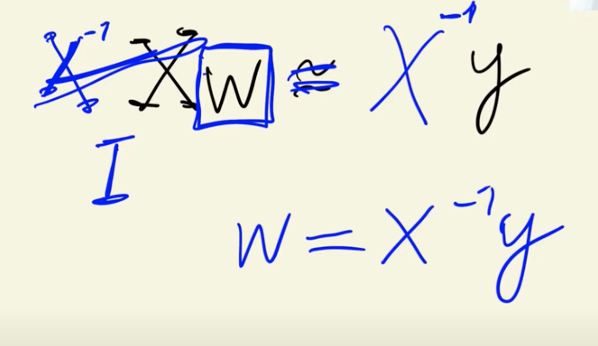
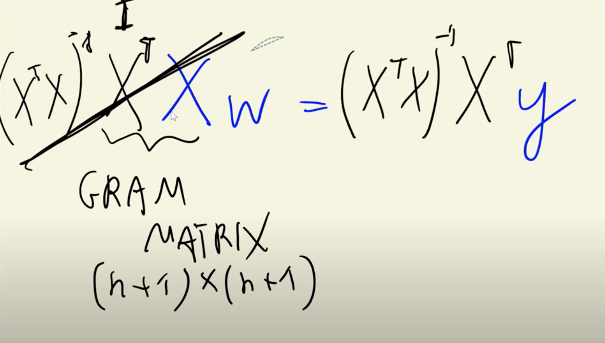

>[Back to Week Menu](README.md)
>
>Previous Theme: [Linear regression: vector form](06_linear_regression_vector.md)
>
>Next Theme: [Baseline model for car price prediction project](08_baseline_model.md)

## Training linear regression: Normal equation
_[Video source](https://www.youtube.com/watch?v=vM3SqPNlStE&list=PL3MmuxUbc_hIhxl5Ji8t4O6lPAOpHaCLR&index=18)_


### Problem Description


Ideally, we want:

$Xw = y$

### LR Simple Equation Solution

We need to find $w$.
Assuming that $X$ is invertible. This means there exists $X^{-1}$ which is an inverse. Then we multiply both parts of our equation by $X^{-1}$:



$Xw = y$

$X^{-1}Xw = X^{-1}y$, because $X^{-1}X = I$

$Iw = X^{-1}y$

$w = X^{-1}y$

### LR Simple Equation Solution Issues

Since $X$ is usually a rectangular matrix, it is not square, and its inverse might not exist.
And the solution doesn't exist. Therefore, we seek an approximate solution.

### LR Normal Equation Solution



$Xw = y$

Multiply by $X^T$:

$X^TXw = X^Ty$

$X^TX$ - it's a **Gram Matrix**, and it's a squared Matrix ((n+1)x(n+1)). And for this Matrix usually the inverse exists.

Multiply by $(X^TX)^{-1}$ - the inverse of the Gram matrix:

$(X^TX)^{-1} \cdot X^TXw = (X^TX)^{-1} \cdot X^Ty => (X^TX)^{-1} \cdot X^TX = I =>$

$Iw = (X^TX)^{-1} \cdot X^Ty =>$

$w = (X^TX)^{-1} \cdot X^Ty$

$w$ - is not the solution, because the solution doesn't exist. This $w$ - the closest possible solution to this system.

### Normal Equation Python Implementation

```python
X = [
    [148, 24, 1385],
    [132, 25, 2031],
    [453, 11, 86],
    [158, 24, 185],
    [172, 25, 201],
    [413, 11, 86],
    [38,  54, 185],
    [142, 25, 431],
    [453, 31, 86]
]

X = np.array(X)
ones = np.ones(X.shape[0])
X = np.column_stack([ones, X])  # add 1 

y = [100, 200, 150, 250, 100, 200, 150, 250, 120]

XTX = X.T.dot(X)    # Gram matrix
XTX_inv = np.linalg.inv(XTX)

XTX.dot(XTX_inv).round(1)
>> array([[ 1., -0.,  0.,  0.],
       [ 0.,  1.,  0., -0.],
       [ 0.,  0.,  1.,  0.],
       [ 0., -0.,  0.,  1.]])

w_full = XTX_inv.dot(X.T).dot(y)
w0 = w_full[0]
w = w_full[1:]

w0, w
>> (300.06776692555593, array([-0.22774253, -2.5769413 , -0.02301206]))
```

$w_0$ - bias term

$w$ - the weights

### Creating Training Function

```python
def train_linear_regression(X, y):
    ones = np.ones(X.shape[0])
    X = np.column_stack([ones, X])

    XTX = X.T.dot(X)
    XTX_inv = np.linalg.inv(XTX)

    w_full = XTX_inv.dot(X.T).dot(y)
    
    return w_full[0], w_full[1:]
```

_[Back to the top](#linear-regression-vector-form)_