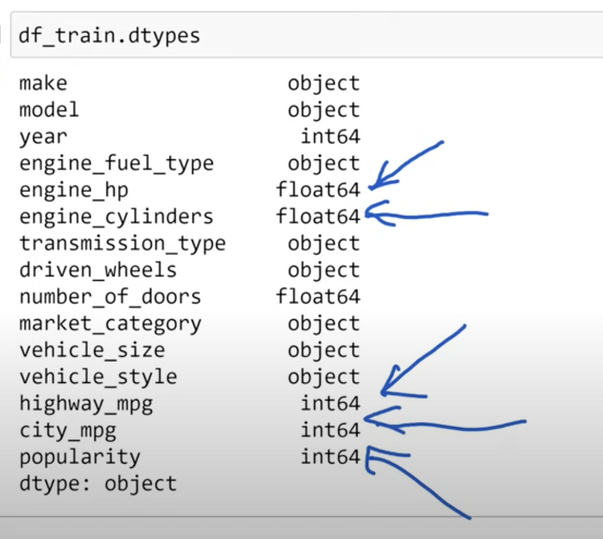
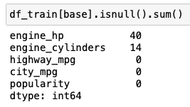
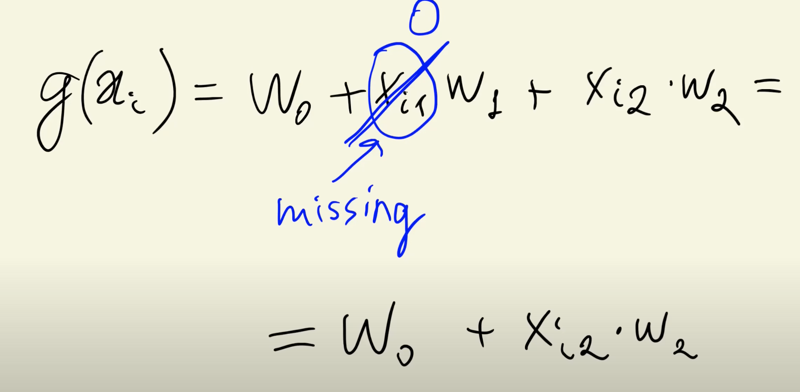
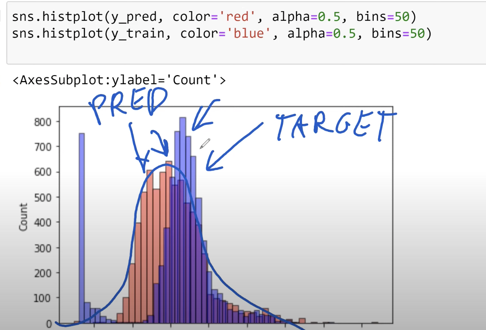

>[Back to Week Menu](README.md)
>
>Previous Theme: [Training linear regression: Normal equation](07_linear_regression_training.md)
>
>Next Theme: [Root mean squared error](09_rmse.md)

## Baseline model for car price prediction project
_[Video source](https://www.youtube.com/watch?v=vM3SqPNlStE&list=PL3MmuxUbc_hIhxl5Ji8t4O6lPAOpHaCLR&index=19)_


### Building a baseline car price model.

First, extract all numerical columns from the **Train** dataset:



### Extracting basic features for linear regression.

```python
base = ['engine_hp', 'engine_cylinders', 'highway_mpg', 'city_mpg', 'popularity']

# Extract NumPy array
X_train = df_train[base].values
```

Try to train a Model 

```python
train_linear_regression(X_train, y_train)
>> (nan, array([nan, nan, nan, nan, nan]))
```

This issue occurs due to missing or NaN values.

### Handling Missing Values



The simplest way to handle missing values is to fill them with '0'. It makes our Model ignore these features.



### Replacing Missing Values with Zeros for Training

Although replacing missing values with zeros isn't always ideal, it often works well in machine learning.

```python
X_train = df_train[base].fillna(0).values

train_linear_regression(X_train, y_train)
>> (7.927257388070117,
 array([ 9.70589522e-03, -1.59103494e-01,  1.43792133e-02,  1.49441072e-02,
        -9.06908672e-06]))
```

### Predictions and Comparison

After training, we get weights $w_0$ and $w$, which we can use to make predictions using our train dataset:

```python
w0, w = train_linear_regression(X_train, y_train)
y_pred = w0 + X_train.dot(w)
```

To compare predictions and target values, plot the data:
```python
sns.histplot(y_pred, color='red', alpha=0.5, bins=50)
sns.histplot(y_train, color='blue', alpha=0.5, bins=50)
```



Next, we'll evaluate the performance of our model.


_[Back to the top](#baseline-model-for-car-price-prediction-project)_