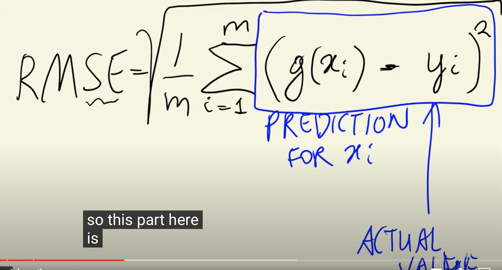

>[Back to Week Menu](README.md)
>
>Previous Theme: [Root mean squared error](09_rmse.md)
>
>Next Theme: [Feature engineering](11_feature_engineering.md)

## Using RMSE on validation data
_[Video source](https://www.youtube.com/watch?v=vM3SqPNlStE&list=PL3MmuxUbc_hIhxl5Ji8t4O6lPAOpHaCLR&index=21)_

We need to quantify how bad our Model is.

### RMSE Formula

$$RMSE = \sqrt{ \frac{1}{m} \displaystyle\sum_{i=1}^m {(g(x_i) - y_i)^2}}$$

- $g(x_i)$ - the prediction for $x_i$
- $y_i$ - the actual value
- $m$ - the number of observations in the dataset (i.e. cars)



### RMSE Python Implementation

```python
def rmse(y, y_pred):
    se = (y - y_pred) ** 2
    mse = se.mean()
    return np.sqrt(mse)
```

```python
rmse(y_train, y_pred)
>> 0.7554192603920132
```

_[Back to the top](#root-mean-squared-error)_