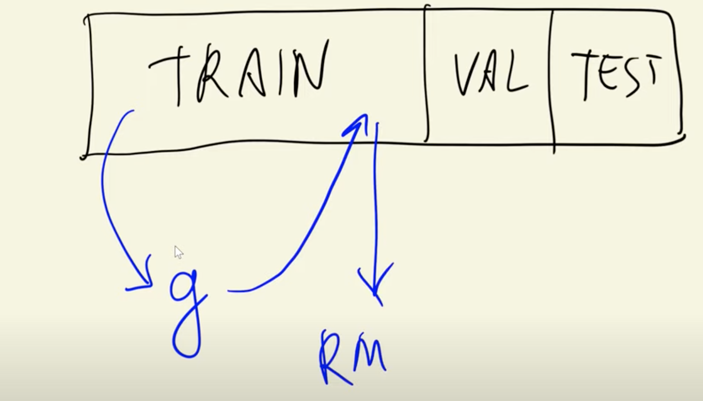
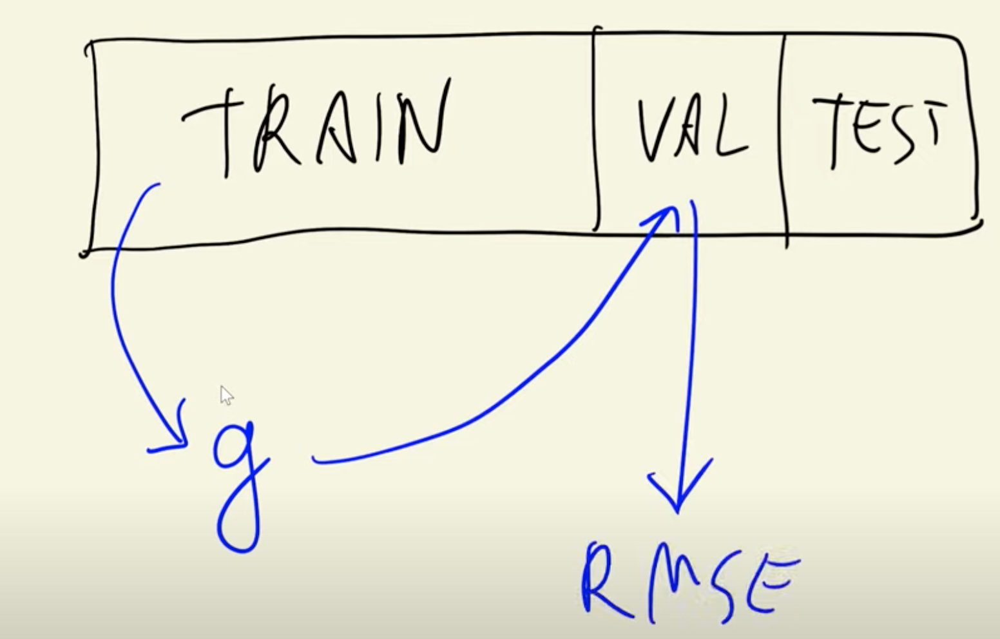
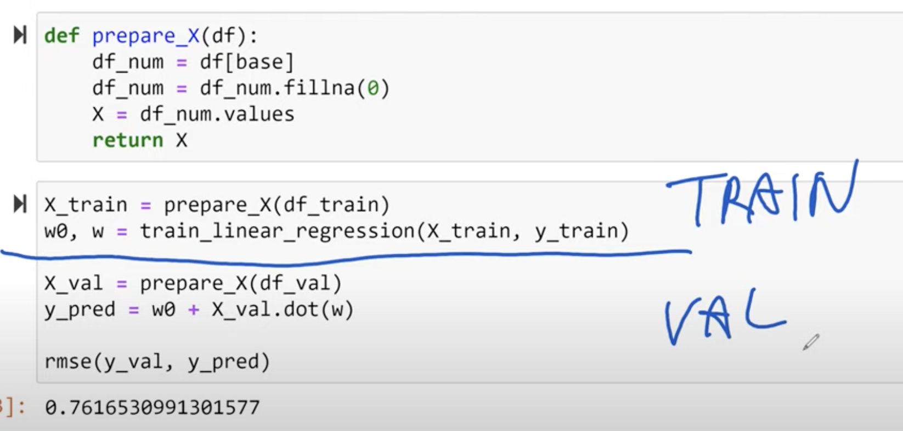

>[Back to Week Menu](README.md)
>
>Previous Theme: [Root mean squared error](09_rmse.md)
>
>Next Theme: [Feature engineering](11_feature_engineering.md)

## Using RMSE on validation data
_[Video source](https://www.youtube.com/watch?v=vM3SqPNlStE&list=PL3MmuxUbc_hIhxl5Ji8t4O6lPAOpHaCLR&index=21)_

### Validating machine learning model using validation data.

We trained our **Linear Regression Model** using **TRAIN** Dataset and then we again applied it to our **TRAIN** Dataset to calculate **RMSE**(Root mean squared error).



Instead of applying Model to **TRAIN** Dataset we should apply it to **VALIDATION** Dataset and calculate **RMSE**.




### Creating feature matrix with prepare x function.

```python
def prepare_X(df):
    df_num = df[base]
    df_num = df_num.fillna(0)
    X = df_num.values
    return X    
```

### Training and validating linear regression model.


```python
X_train = prepare_X(df_train)
w0, w = train_linear_regression(X_train, y_train)

X_val = prepare_X(df_val)
y_pred = w0 + X_val.dot(w)

rmse(y_val, y_pred)
```




_[Back to the top](#using-rmse-on-validation-data)_