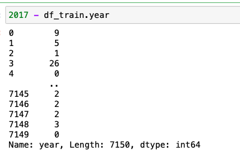
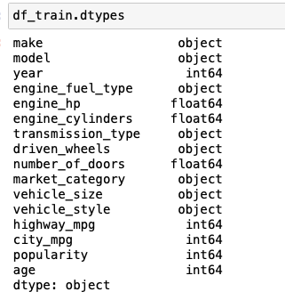
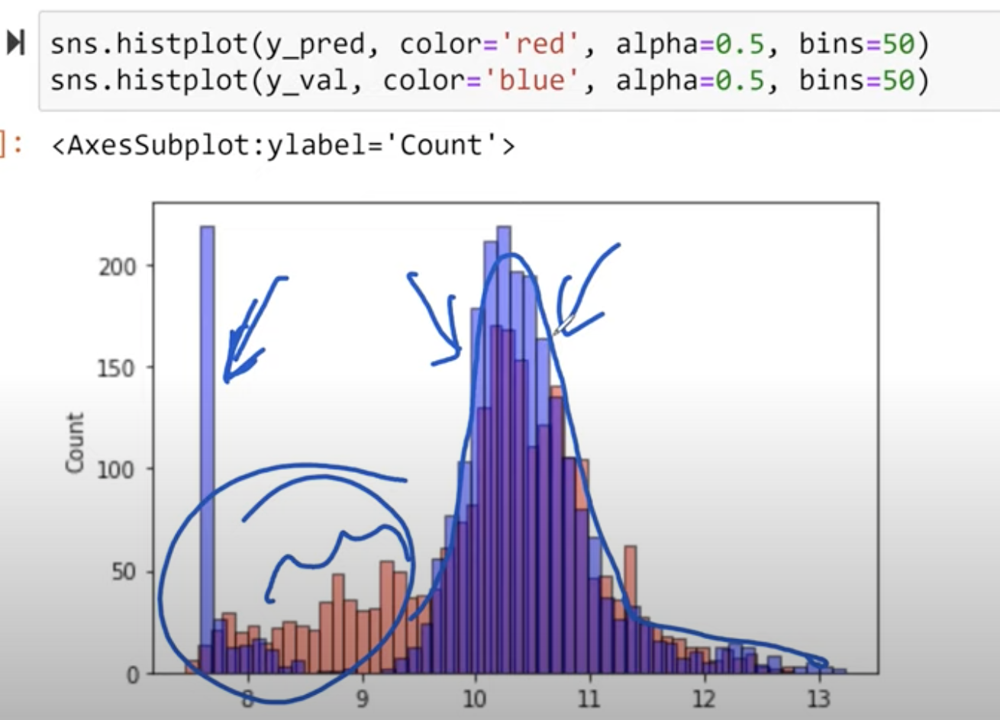

>[Back to Week Menu](README.md)
>
>Previous Theme: [Using RMSE on validation data](10_car_price_validation.md)
>
>Next Theme: [Categorical variables](12_categorical_variables.md)

## Feature engineering
_[Video source](https://www.youtube.com/watch?v=vM3SqPNlStE&list=PL3MmuxUbc_hIhxl5Ji8t4O6lPAOpHaCLR&index=22)_


### Adding car age variable to model.



### Modifying data frame to add feature.

Add new feature **age** to our Model in function **def prepare_X(df)**:
```python
def prepare_X(df):
    df['age'] = 2017 - df.year
    features = base + ['age']
    
    df_num = df[features]
    df_num = df_num.fillna(0)
    X = df_num.values
    return X

X_train = prepare_X(df_train)
```

But in this way we modified our dataframe (added new column 'age')



### Function creates copy to avoid data modification.

Create a copy of dataframe at the beginning of the function **prepare_X(df)** to avoid a modification of the input dataframe

```python
def prepare_X(df):
    df = df.copy()
    
    df['age'] = 2017 - df.year
    features = base + ['age']
    
    df_num = df[features]
    df_num = df_num.fillna(0)
    X = df_num.values
    return X
```

### Improved model with validation data set.

Now train our Model using modified **prepare_X()** function
```python
X_train = prepare_X(df_train)
w0, w = train_linear_regression(X_train, y_train)

X_val = prepare_X(df_val)
y_pred = w0 + X_val.dot(w)

rmse(y_val, y_pred)
>> 0.5172055461058335
```

And we see, that our Model was improved:
* Now RMSE = 0.5172055461058335
* Before RMSE = 0.7616530991301601

Now see the plot:
```python
sns.histplot(y_pred, color='red', alpha=0.5, bins=50)
sns.histplot(y_val, color='blue', alpha=0.5, bins=50)
```


_[Back to the top](#feature-engineering)_