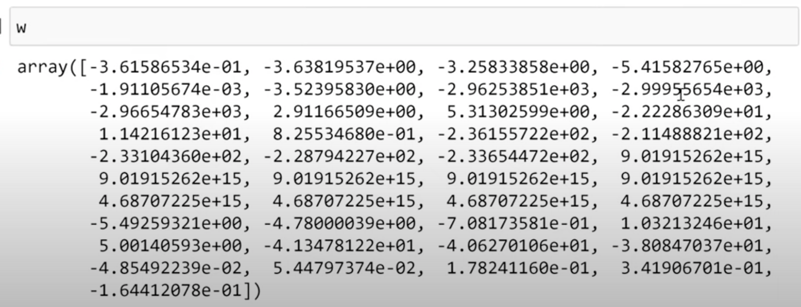

>[Back to Week Menu](README.md)
>
>Previous Theme: [Feature engineering](11_feature_engineering.md)
>
>Next Theme: [Regularization](13_regularization.md)

## Categorical variables
_[Video source](https://www.youtube.com/watch?v=vM3SqPNlStE&list=PL3MmuxUbc_hIhxl5Ji8t4O6lPAOpHaCLR&index=23)_

**Categorical variables** are variables that represent categories, typically as strings. In Pandas, these are of the 'object' type. Some categorical variables may appear numerical but are actually categorical (e.g., Number of Doors).


### Representing Categorical Variables

Categorical variables can be represented as a series of binary columns:


### Creating Binary Columns

For each distinct value of column 'number_of_doors' we create a column with binary value '1' or '0' if 'number_of_doors' equal to this value or not:

For 2 doors:
```python
df_train['num_doors_2'] = (df_train.number_of_doors == 2).astype('int')
```

For all doors:
```python
for v in [2, 3, 4]:
    df_train['num_doors_%s' % v] = (df_train.number_of_doors == v).astype('int')
```


### Adding Categorical Variables to the Feature Matrix (number_of_doors)

```python
def prepare_X(df):
    df = df.copy()
    features = base.copy()
    
    df['age'] = 2017 - df.year
    features.append('age')
    
    for v in [2, 3, 4]:
        df['num_doors_%s' % v] = (df.number_of_doors == v).astype('int')
        features.append('num_doors_%s' % v)
    
    df_num = df[features]
    df_num = df_num.fillna(0)
    X = df_num.values
    return X
```


Train with new features:
```python
X_train = prepare_X(df_train)
w0, w = train_linear_regression(X_train, y_train)

X_val = prepare_X(df_val)
y_pred = w0 + X_val.dot(w)

rmse(y_val, y_pred)
```


The result improved only slightly. The 'number_of_doors' feature is not that useful.

### Adding the 'Make' Variable to the Feature Matrix

Get the top 5 popular car makes and convert to list:
```python
list(df.make.value_counts().head().index)
>> ['chevrolet', 'ford', 'volkswagen', 'toyota', 'dodge']
```

Modify the **prepare_X(df)** function to include these top 5 makes:

```python
makes = list(df.make.value_counts().head().index)

def prepare_X(df):
    df = df.copy()
    features = base.copy()
    
    df['age'] = 2017 - df.year
    features.append('age')
    
    for v in [2, 3, 4]:
        df['num_doors_%s' % v] = (df.number_of_doors == v).astype('int')
        features.append('num_doors_%s' % v)
        
    for v in makes:
        df['make_%s' % v] = (df.make == v).astype('int')
        features.append('make_%s' % v)
    
    df_num = df[features]
    df_num = df_num.fillna(0)
    X = df_num.values
    return X
```

Train the model again and observe the improvement:
```python
X_train = prepare_X(df_train)
w0, w = train_linear_regression(X_train, y_train)

X_val = prepare_X(df_val)
y_pred = w0 + X_val.dot(w)

rmse(y_val, y_pred)
```
Result was improoved:


### Dictionary of top categorical variables

Create a dictionary for top categorical variables:

```python
categorilac_variables = [
    'make',
    'engine_fuel_type', 
    'transmission_type', 
    'driven_wheels', 
    'market_category', 
    'vehicle_size', 
    'vehicle_style'
]
```

```python
categories = {}

for c in categorilac_variables:
    categories[c] = list(df[c].value_counts().head().index)
```

### Add categories to **prepare_X(df)** function


```python
def prepare_X(df):
    df = df.copy()
    features = base.copy()
    
    df['age'] = 2017 - df.year
    features.append('age')
    
    for v in [2, 3, 4]:
        df['num_doors_%s' % v] = (df.number_of_doors == v).astype('int')
        features.append('num_doors_%s' % v)
        
    for c, values in categories.items():
        for v in values:
            df['%s_%s' % (c, v)] = (df[c] == v).astype('int')
            features.append('%s_%s' % (c, v))
        
    df_num = df[features]
    df_num = df_num.fillna(0)
    X = df_num.values
    return X
```

Then Train with categories:
```python
X_train = prepare_X(df_train)
w0, w = train_linear_regression(X_train, y_train)

X_val = prepare_X(df_val)
y_pred = w0 + X_val.dot(w)

rmse(y_val, y_pred)
```

But the result is significantly different (huge):


Something went wrong.
$w_0$ and $w$ also huge:



_[Back to the top](#categorical-variables)_