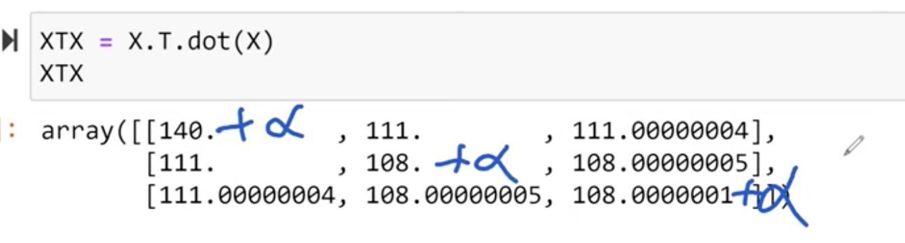
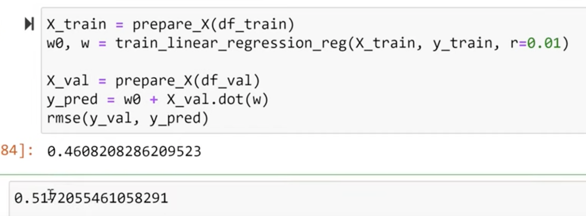

>[Back to Week Menu](README.md)
>
>Previous Theme: [Categorical variables](12_categorical_variables.md)
>
>Next Theme: [Tuning the model](14_tuning_model.md)

## Regularization
_[Video source](https://www.youtube.com/watch?v=vM3SqPNlStE&list=PL3MmuxUbc_hIhxl5Ji8t4O6lPAOpHaCLR&index=24)_


### Problem description - Linear Combination

Formual for normal equation:

$w = (X^TX)^{-1} \cdot X^Ty$

Sometimes we can get the wrong result for $w$.

The problem that $(X^TX)^{-1}$ doesn't exist. Sometimes it happens when Matrix $X$ has duplicate columns (features).

Sometimes we don't get an error, because of the noise (for example, value in one column is '5' and in other '5.000000001'). And values are different.

### Problem Solution - Regularization

The solution to this problem is to **add** a small number $\alpha$ to the diagonal of this Matrix $(X^TX)$:



**Regularization** - controlling the weights that they don't grow to much.

We add to out $(X^TX)$ matrix Identity Matrix multiplied by some small number (parameter). The large number we have on diagonal, the smaller values on Inversive Matrix.


### Regularization Implementation

Slightly change function **def train_linear_regressio(X, y)**:

```python
def train_linear_regression_reg(X, y, r=0.001):
    ones = np.ones(X.shape[0])
    X = np.column_stack([ones, X])

    XTX = X.T.dot(X)
    XTX = XTX + r * np.eye(XTX.shape[0]) 
    
    XTX_inv = np.linalg.inv(XTX)

    w_full = XTX_inv.dot(X.T).dot(y)
    
    return w_full[0], w_full[1:]
```

Train Model:
```python
X_train = prepare_X(df_train)
w0, w = train_linear_regression_reg(X_train, y_train, r=0.01)

X_val = prepare_X(df_val)
y_pred = w0 + X_val.dot(w)

rmse(y_val, y_pred)
```

Our result was improved:



Thern we need to find what is the best value for the parameter r.

_[Back to the top](#regularization)_