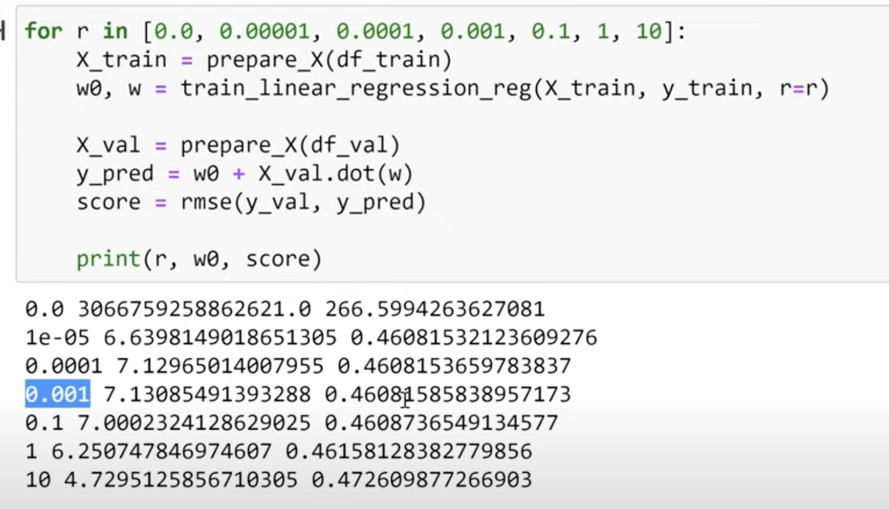

>[Back to Week Menu](README.md)
>
>Previous Theme: [Regularization](13_regularization.md)
>
>Next Theme: [Using the model](15_using_model.md)

## Tuning the model
_[Video source](https://www.youtube.com/watch?v=vM3SqPNlStE&list=PL3MmuxUbc_hIhxl5Ji8t4O6lPAOpHaCLR&index=25)_


### Finding best regularization parameter for linear regression

We will use the validation dataset for finding the best value. We'll try a bunch of different values from [0.0, 0.00001, 0.0001, 0.001, 0.1, 1, 10].

```python
for r in [0.0, 0.00001, 0.0001, 0.001, 0.1, 1, 10]:
    X_train = prepare_X(df_train)
    w0, w = train_linear_regression_reg(X_train, y_train, r=r)

    X_val = prepare_X(df_val)
    y_pred = w0 + X_val.dot(w)

    score = rmse(y_val, y_pred)
    
    print(r, w0, score)
```


r=0.001 is a good one.

Train our Model with the best regularization parameter:
```python
r=0.001
X_train = prepare_X(df_train)
w0, w = train_linear_regression_reg(X_train, y_train, r=r)

X_val = prepare_X(df_val)
y_pred = w0 + X_val.dot(w)

rmse(y_val, y_pred)
```

Then we need to check our Model with **TEST** Dataset as well.

_[Back to the top](#tuning-the-model)_