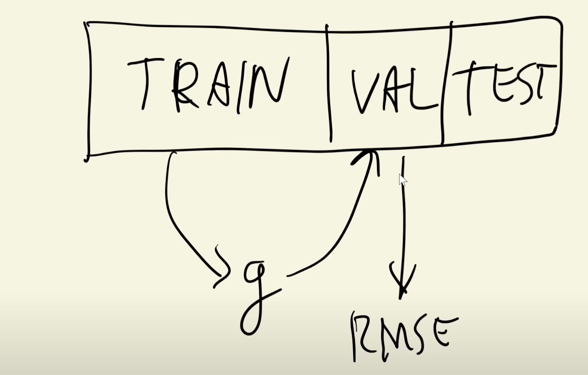
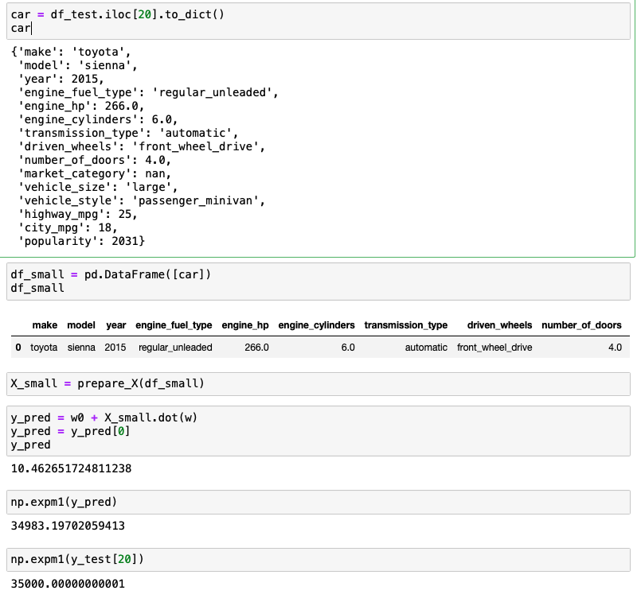

>[Back to Week Menu](README.md)
>
>Previous Theme: [Tuning the model](14_tuning_model.md)
>
>Next Theme: [Car price prediction project summary](16_summary.md)

## Using the model
_[Video source](https://www.youtube.com/watch?v=vM3SqPNlStE&list=PL3MmuxUbc_hIhxl5Ji8t4O6lPAOpHaCLR&index=26)_


### Training the Final Model on the Full Dataset

Initially, we split our dataset into three parts:
* TRAIN
* VALIDATION
* TEST

We trained our model on the **TRAIN** dataset, applied it to the **VALIDATION** dataset, and then calculated the **RMSE**:


Now, we will train the model on the combined **TRAIN** and **VALIDATION** datasets (**FULL TRAIN**), apply it to the **TEST** dataset, and calculate the **RMSE**:


### Combining the Train and Validation Data Frames

We combine the **TRAIN** and **VALIDATION** datasets and reset the indices.

```python
df_full_train = pd.concat([df_train, df_val])
df_full_train = df_full_train.reset_index(drop=True)
```

Prepare the **Feature Matrix X**:
```python
X_full_train = prepare_X(df_full_train)
```

Concatenate **Targets** from **TRAIN** and **VALIDATION**:
```python
y_full_train = np.concatenate([y_train, y_val])
```

Train the model using the combined datasets:
```python
w0, w = train_linear_regression_reg(X_full_train, y_full_train, r=0.001)
```

Prepare the **TEST** dataset and validate:
```python
X_test = prepare_X(df_test)
y_pred = w0 + X_test.dot(w)

score = rmse(y_test, y_pred)
score
```


The RMSE is almost the same as in previous models, suggesting that our model generalizes well and that this score was not achieved by chance.

### Using the Final Model for Prediction

We can use our Final Model to predict the price of a car. We take a car's features and input them into our Final Model to predict its price.


### Predicting a Car Price

We can take any car from the TEST dataset (it's okay, because this car was not used during training):


Extract the car data:
```python
car = df_test.iloc[20].to_dict()
car
```

Create a DataFrame:
```python
df_small = pd.DataFrame([car])
df_small
```

Prepare the Feature matrix:
```python
X_small = prepare_X(df_small)
```

Predict the price:
```python
y_pred = w0 + X_small.dot(w)
y_pred = y_pred[0]
y_pred
```

Predicted price:
```python
np.expm1(y_pred)
>> 34983.19702059413
```

Actual price:
```python
np.expm1(y_test[20])
>> 35000.00000000001
```



_[Back to the top](#using-the-model)_