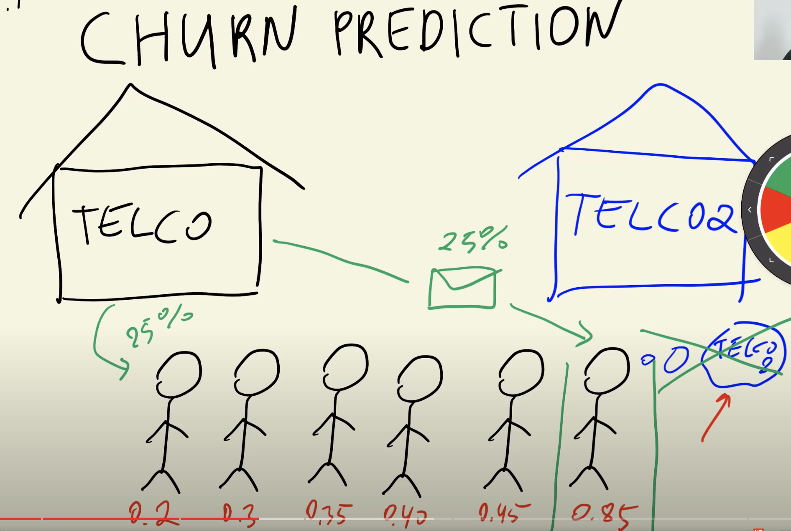
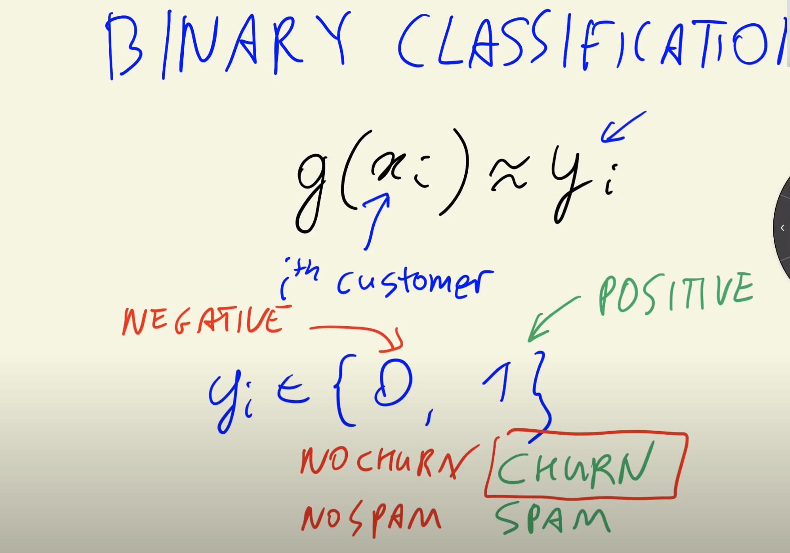
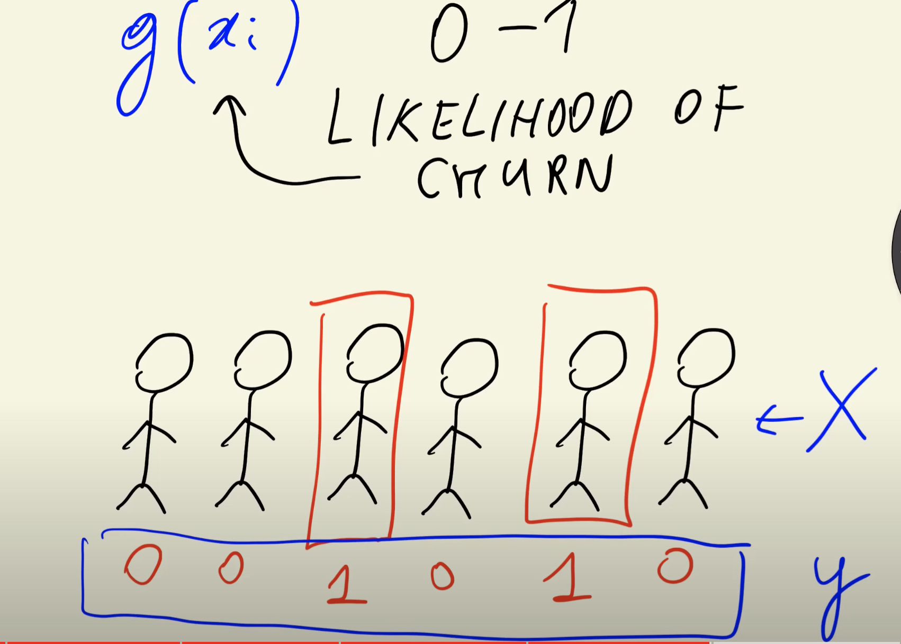

>[Back to Week Menu](README.md)
>
>Next Theme: [Data preparation](02_data_preparation.md)

## Churn prediction project
_[Video source](https://www.youtube.com/watch?v=0Zw04wdeTQo&list=PL3MmuxUbc_hIhxl5Ji8t4O6lPAOpHaCLR)_

### Introduction

* Week 3 of the Machine Learning Zoomcamp focuses on using machine learning for classification problems.
* The case study for this week is churn prediction for a telecom company.

### Churn Prediction Overview

* Aim to predict which customers are likely to leave the service.
* Churn means stopping the use of services and possibly moving to a competitor.

### Identifying Customer Churn

* Objective is to assign a likelihood **score** (between 0 and 1) to each customer based on their probability of churning.
* Customers with higher likelihood can be targeted with promotional offers to prevent them from leaving.

### Importance of Accuracy

* Accurate prediction is crucial to avoid offering discounts to customers who are not going to churn, thereby losing money.

### Machine Learning Approach

* The problem is approached as a binary classification problem.
* Label 1 indicates churn and label 0 indicates retention.

### Data Preparation

* Historical data is used to train the model.
* Features could include demographic information, contract details, payment history, etc.

### The Main idea

To **build a model** with historical data from customers and assign a score of the likelihood of churning.

### Dataset information

Link for Dataset:
https://www.kaggle.com/blastchar/telco-customer-churn

### Project Plan:
1. Prepare data
2. Set up the validation framework (using Scikit-Learn)
3. Do EDA (Exploratory data analysis)
4. Feature Importance Metrics: Churn rate and Risk ratio
5. Feature Importance Metrics: Mutual information
6. Feature Importance Metrics: Correlation
7. Encoding categorical variables (using Scikit-Learn)
8. Logistic regression
9. Training logistic regression with Scikit-Learn
10. Model interpretation
11. Using the model

### Summary

The ultimate goal is to build a model that can accurately predict customer churn and help in taking preemptive actions to retain customers.

_[Back to the top](#churn-prediction-project)_