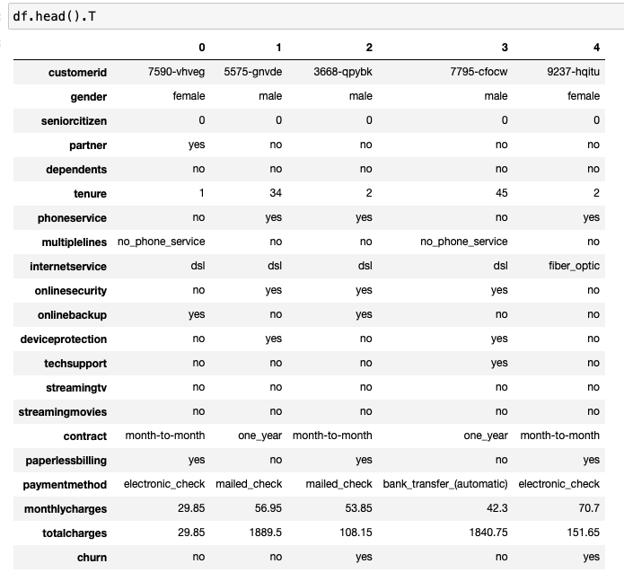
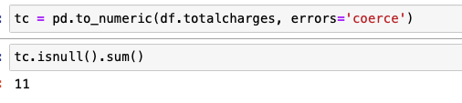
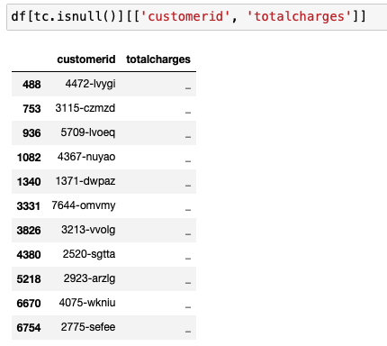

>[Back to Week Menu](README.md)
>
>Previous Theme: [Churn prediction project](01_churn_project.md)
>
>Next Theme: [Setting up the validation framework](03_validation.md)

## Data preparation
_[Video source](https://www.youtube.com/watch?v=VSGGU9gYvdg&list=PL3MmuxUbc_hIhxl5Ji8t4O6lPAOpHaCLR)_


### Introduction
- Lesson 2 focuses on **data downloading and preprocessing**.
- Utilizes **Pandas** for data handling.

### Data Downloading
- Data is downloaded using `wget` command in Linux:
```python
!wget $data -O data-week-3.csv
```
- Alternatively, the data can be downloaded manually via a web browser.


### Data Reading with Pandas
- The data is read into a Pandas DataFrame using `read_csv()` function
```python
df = pd.read_csv('data-week-3.csv')
```

## Transposing DataFrame
- Transposing the DataFrame helps in viewing all columns at once.
- Useful for getting an **overview of all features in the dataset**.
```python
df.head().T
```




### Data Preparation: Column Names
- Column names are made consistent by converting them to **lowercase** and replacing **spaces with underscores**:

```python
df.columns = df.columns.str.lower().str.replace(' ', '_')

categorical_columns = list(df.dtypes[df.dtypes == 'object'].index)

for c in categorical_columns:
    df[c] = df[c].str.lower().str.replace(' ', '_')
```

### Exploring Data Types
- Checks are done to identify the **data types of each column**.
- Special attention is given to ensure **numerical variables are correctly identified**.
```python
df.dtypes
```
Field 'totalcharges' looks like a number but has 'object' type:


### Handling Missing Values
- The dataset uses **space** to denote missing data.
- These are replaced with **'Not a Number' (NaN)** values.

```python
pd.to_numeric(df.totalcharges, errors='coerce')
```

There are 11 missing values (has NULL value):




### Filling Missing Values
- Missing values in the `total_charges` column are **filled with zeros**.
- This is a basic approach and not necessarily the best one.
```python
df.totalcharges = pd.to_numeric(df.totalcharges, errors='coerce')
df.totalcharges = df.totalcharges.fillna(0)
```

### Converting Categorical Variables
- The `churn` column contains **'Yes' or 'No'** values.
- These are converted to **binary (1 or 0)** to make it suitable for machine learning algorithms.

```python
df.churn = (df.churn == 'yes').astype(int)
```

### Summary
- The lesson covers **data downloading, reading, and initial preprocessing steps**.
- Problems like **inconsistent column names, missing values, and categorical variables are addressed**.
- The data is now ready for the **validation framework setup in the next lesson**.


_[Back to the top](#data-preparation)_