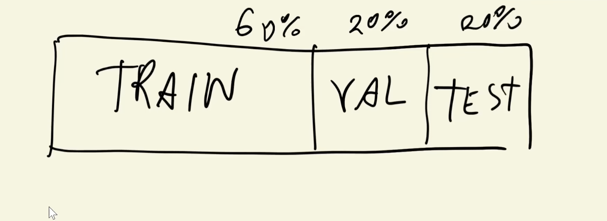
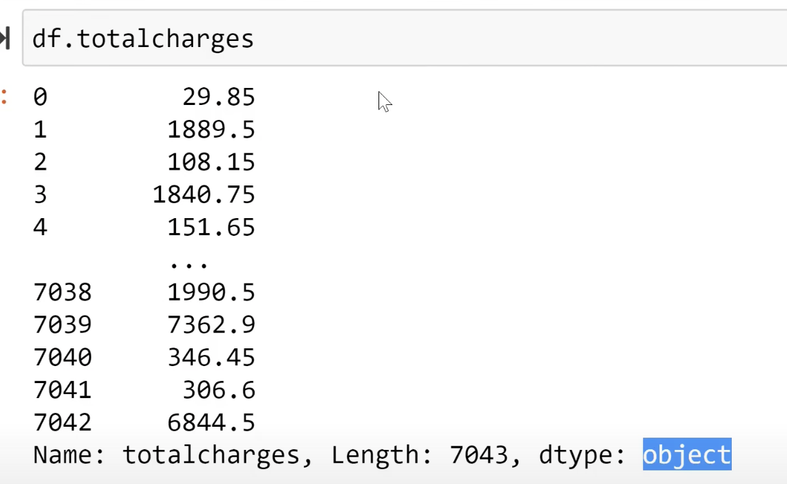

>[Back to Week Menu](README.md)
>
>Previous Theme: [Data preparation](02_data_preparation.md)
>
>Next Theme: [EDA](04_eda.md)

## Setting up the validation framework
_[Video source](https://www.youtube.com/watch?v=_lwz34sOnSE&list=PL3MmuxUbc_hIhxl5Ji8t4O6lPAOpHaCLR)_


### Introduction
- The lesson focuses on setting up a **Validation Framework** in machine learning.
- Emphasizes the use of **Scikit-learn**, a Python library for machine learning.

## Data Partitioning
- The aim is to split the entire dataset into **Train, Validation, and Test sets**.
- Discusses the typical 60-20-20 distribution for Train-Validation-Test sets.



## Scikit-learn Introduction
- Scikit-learn provides implementations for most common machine learning algorithms.
- Introduces the utility function `train_test_split` for splitting data.

### Installing Scikit-learn
- Scikit-learn needs to be installed to proceed.
- Required package: `model_selection` for `train_test_split` function.

## Test Size Specification
- Specifies the **Test Size** parameter to control the size of the test set.
- Example: For a test set of 20%, use 0.2 as the value.

## Seed Fixing
- Fixes the random seed to make the results reproducible across different runs.

## Two-Step Data Splitting
- First, the data is split into **Full Train** and **Test** sets.
- Second, the **Full Train** set is further split into **Train** and **Validation** sets.

### Calculation for Second Split
- A calculation is needed to correctly specify the test size for the second split.
- This is because the second split operates on the **Full Train** set, not the original dataset.

## Index Shuffling
- Scikit-learn's `train_test_split` shuffles indices by default.
- The instructor prefers sequential indices but clarifies that it doesn't affect model performance.

## Target Variables (y)
- Extracts the target variable `churn` into separate NumPy arrays.
- These arrays are then used for training and validation.

## Data Cleaning
- Deletes the `churn` variable from the data frames to avoid accidental usage.

## Summary
- The lesson sets up a robust validation framework using Scikit-learn.
- Prepares the dataset for the next steps in the machine learning pipeline, including Exploratory Data Analysis.




```python
```


_[Back to the top](#setting-up-the-validation-framework)_